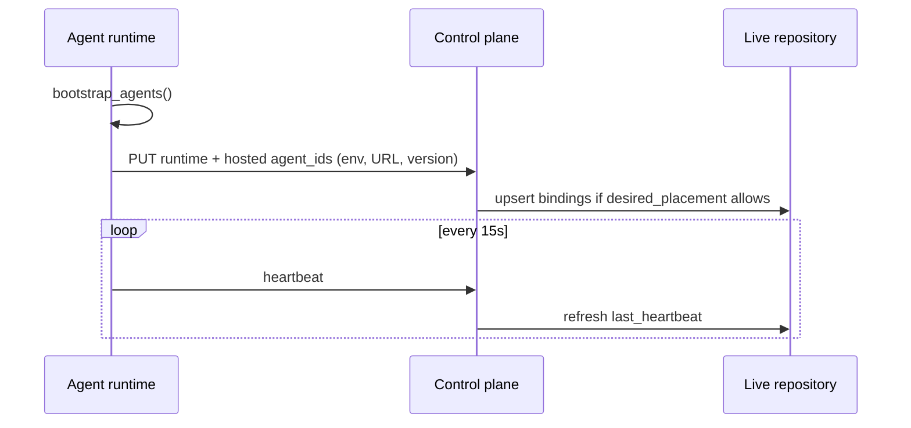
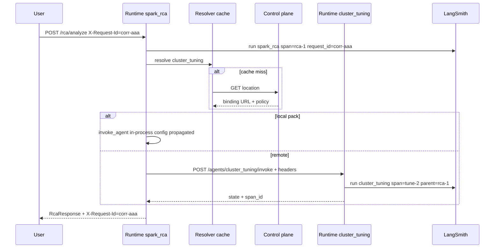
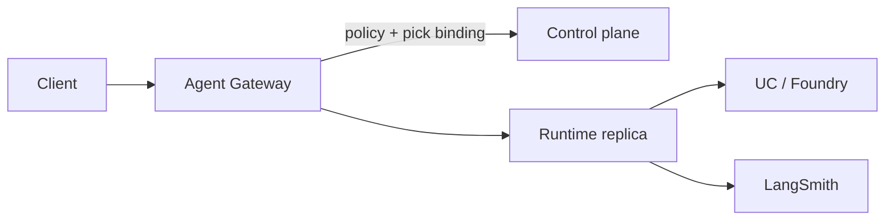

# Agent control plane & routing (design review)

**Learning path:** B9b · [Preface](../README.md)  
**← Previous:** [Agent deployment & composition](agent-deployment-and-composition.md) · **Next:** [Environments](../platform/environments.md) →

## Chapter summary

**Design-only** review of a future governance / routing control plane for managed agents. Option B (domain-split Apps + remote invoke) and Option C (hub + location catalog) are **parked** — do not implement from this page.

**Outcome:** reviewers share one vocabulary for registry, gateway vs directory, and phased rollout constraints.

---

**Status:** **Design only — not R1, not scheduled for implementation.**  
**Decision (2026-08-18):** Option B (domain-split Apps + remote invoke) and Option C (hub + location catalog) are **parked**. This page is the review artifact for a **larger** idea: a **governance / routing control plane** for managed agents. Execute only after architecture sign-off.

**Audience:** platform architects, security, SRE, agent authors.  
**Not this page:** how to call `invoke_agent` in YAML today — [Orchestration topology](../framework/orchestration-topology.md). How to deploy one vs many Apps **without** a control plane — [Agent deployment & composition](agent-deployment-and-composition.md). What we run today (inner) vs what we plan for the platform (outer) — [Inner vs outer architecture](inner-outer-architecture.md).

---

## 0. How to read this document

| Section | Purpose |
|---------|---------|
| **§1–3** | Why this is bigger than Option B/C; analogies; vocabulary |
| **§4** | What exists today vs the target |
| **§5–6** | Architecture: planes, **gateway vs directory** (the main fork) |
| **§7** | Governance: health, location, permissions, policies, lifecycle |
| **§8** | Live repository + contracts |
| **§9** | Orchestration and agent-to-agent (RCA → cluster tuning example) |
| **§10** | Heartbeat, scaling (Spark-like), load balancing |
| **§11** | Hosting, HA, identity, multi-env, laptop |
| **§12** | Observability and correlation (LangSmith) |
| **§13** | Other extension use-cases |
| **§14–16** | Flows, data models, API sketches |
| **§17–19** | Pros / cons, edge cases, anti-patterns |
| **§20–22** | Phasing, open questions for review, related work |

**Hard rules already decided for EDIM (do not reopen here):**

- One process / App is bound to **one** `EDIM_ENV` (no cross-env SQL or agent I/O).
- Graphs stay **logical** (`agent_id`); physical placement is config/control-plane, not YAML URLs.
- Product agents stay free of vendor SDKs for tracing/HTTP routing; framework + host own plumbing.
- Git remains source of truth for **graph definitions** (`*.agent.yaml`).

---

## 1. Purpose and non-goals

### 1.1 Purpose

Build (later) a **centralized, live control plane** that treats agents as **managed services**:

- **Where** each `agent_id` can be invoked (location)
- **Whether** it is allowed to run (permissions, policies, lifecycle)
- **Whether** it is healthy (heartbeat, drain, circuit break)
- **How** callers find it without hard-coding Apps
- **How** hops are correlated (observability)
- **Optionally** how northbound traffic is admitted and routed (gateway)

This is the same *kind* of problem as API management (MuleSoft / Apigee), microservice discovery (Consul / Kubernetes Endpoints), and cluster managers (Spark driver tracking executors) — applied to **YAML agents** instead of ESBs or JVM executors.

### 1.2 Why this is not “just Option B/C”

| Idea | Scope | Risk if rushed |
|------|--------|----------------|
| **Option B** | Split Apps by domain; HTTP child invoke | Custom glue, duplicated catalogs per App |
| **Option C (lite)** | YAML/env location map on a hub | Still tied to a deploy; no governance |
| **This concept** | Shared live repository + policy + health + (optional) gateway + future scale-out | New product surface, HA, identity, multi-env, blast radius |

Option B/C are **topology tactics**. This document is a **platform product**: a control plane that those tactics (and others) can plug into.

### 1.3 Non-goals (until sign-off)

- No code, no new packages, no generic invoke route, no location YAML in R1.
- Not a replacement for Databricks Apps / ACA as **hosts** of agent runtimes.
- Not a replacement for LangSmith as the **trace UI**.
- Not a marketplace / agent store in v1 of this design.
- Not cross-env routing.
- Not HITL resume (separate backlog item; this plane can *store* `hitl_required` later).
- Not executing LangGraph **inside** the control plane (see §6).

---

## 2. Analogies (and where they stop)

Use analogies for intuition; do not copy their products.

### 2.1 MuleSoft / API management

| They do | EDIM analogue |
|---------|----------------|
| Central API catalog | Agent location + definition catalog |
| Policies (auth, rate limit, SLA) | Invoke policies per `agent_id` / caller |
| Gateway in the data path | **Optional** Agent Gateway (§6.2) |
| Analytics on traffic | Correlation + LangSmith + control-plane audit |

**Stop:** MuleSoft often *is* the runtime for integrations. EDIM agents already have a runtime (`edim-dde-api` + LangGraph). The control plane should **govern and route**, not re-implement SQL/Foundry/YAML.

### 2.2 Microservices (discovery + mesh)

| They do | EDIM analogue |
|---------|----------------|
| Service name ≠ pod IP | `agent_id` ≠ App URL |
| Registration + heartbeat | Runtime registers hosted agents |
| Sidecar / client-side LB | Resolver cache in each App (recommended default) |
| Server-side LB / ingress | Optional gateway |

**Stop:** Agents are **coarse** (one graph ≈ one “service”), not hundreds of tiny RPCs. Chatty mesh features (retry storms, mTLS everywhere) are optional later.

### 2.3 Spark driver / executors (user’s metaphor)

| Spark | EDIM (proposed) |
|-------|-----------------|
| Driver | Control plane: schedule, track health, do **not** run the job’s executors’ compute |
| Executors | Agent **runtimes** (Apps): run graphs, SQL, LLM |
| Heartbeat | Runtime → control plane: “I still host `spark_rca`” |
| Dynamic allocation | **Later:** scale replica count of a runtime from backlog/queue depth |
| Task scheduler | **Not** a first-class DAG scheduler in v1 — LangGraph already schedules **nodes** inside one agent |

**Stop:** Spark’s driver **is** on the data path for task scheduling of a job. If we put **all HTTP user traffic** through the control plane (MuleSoft-style gateway), we inherit Spark-driver failure modes: one process death stalls everything. That is why §6 splits **directory** vs **gateway**.

### 2.4 Kubernetes

| K8s | EDIM |
|-----|------|
| etcd + API server | Live repository + control-plane API |
| kubelet heartbeat | Runtime heartbeat |
| kube-proxy / Ingress | Gateway (optional) |
| Pod = workload | Agent runtime replica |
| Deployment spec | Desired placement policy (GitOps) vs observed endpoints (heartbeat) |

---

## 3. Vocabulary (disambiguation)

EDIM already uses **“control plane”** for `StateStore` (catalog / sessions / audit). That remains valid. This document adds a **routing/governance** control plane. Names for review:

| Term | Meaning in this doc |
|------|---------------------|
| **Definition catalog** | What the agent *is* — `AgentRecord` today (owner, lifecycle, YAML pointer). Git owns the graph. |
| **Location registry** | Where the agent *runs now* — bindings: env, URL, version, health, weight. |
| **Policy store** | Who may invoke whom, required auth, payload limits, deny-lists, HITL gates. |
| **Live repository** | The centralized store that holds definition metadata + locations + policies + health (may be one DB with several collections). |
| **Agent runtime** | An `edim-dde-api` (or future host) that **executes** graphs. Data plane. |
| **Control plane service** | API that is **not** an agent runtime: register, resolve, policy, health. Must not call Foundry/SQL for business work. |
| **Agent gateway** (optional) | Northbound HTTP that **admits** traffic and **forwards** to a runtime. May share a deploy with the control plane **or** be separate. This is the “load balancer” idea. |
| **Resolver** | Library inside a runtime: given `agent_id` + env → local invoke or remote URL (cached). |
| **`agent_id`** | Logical name (`spark_rca`). Stable across topologies. |
| **Binding** | One physical placement of an `agent_id` in one `EDIM_ENV`. |
| **`correlation_id` / `request_id`** | One id for the **external** operation (HTTP `X-Request-Id`). Shared across hops. |
| **`span_id`** | Unique id for **one** agent invoke. Parent/child via `parent_span_id`. |

**Do not** call StateStore “the location registry.” Today it syncs **definition** rows at bootstrap; it does not route.

---

## 4. Current state (R1) vs target

### 4.1 Today

```text
Client
  → edim-dde-api  (one process, one EDIM_ENV)
       typed routes: /cluster_tuning/recommend, /rca/analyze
       bootstrap_agents() → in-process registry
       invoke_agent → create_agent(child).invoke(state)   # same process only
       StateStore.AgentRecord = metadata sync, not routing
       LangSmith: request_id on HTTP invoke config; nested invoke does not pass config
```

| Capability | Status |
|------------|--------|
| Option A (one App, many packs) | Supported |
| In-process `invoke_agent` | Supported (depth + self-call guard) |
| Typed product HTTP APIs | Supported |
| Cross-app YAML invoke | **Not supported** |
| Location registry | **Not supported** |
| Gateway / LB for agents | **Not supported** |
| Heartbeat of agent hosts | **Not supported** (`/health` is per-process only) |
| Parent/child span ids | **Not supported** (see §12) |

### 4.2 Target (after design review + phased build)

```text
Git (YAML graphs)     Live repository (locations, policy, health, lifecycle)
        │                              │
        │ bootstrap                    │ register / resolve / audit
        ▼                              ▼
 Agent runtimes  ◄──────── resolver ── control plane service
 (execute)                             (does not execute graphs)
        ▲
        │ optional northbound
 Client ──► (optional) Agent Gateway ──► runtime
```

Callers and parent graphs still say `agent_id: spark_rca`. Placement, health, and permission are **looked up**.

---

## 5. Target architecture (planes)

Keep the existing EDIM planes; add a **governance/routing** slice of the control plane.

```text
┌─────────────────────────── EDIM ─────────────────────────────────────┐
│                                                                      │
│  OBSERVABILITY     LangSmith / MLflow / logs  (correlation ids)      │
│                                                                      │
│  GOVERNANCE CP     Live repository · policy · location · heartbeat   │
│  (this doc)        Optional gateway  |  Never owns SQL/Foundry work  │
│                                                                      │
│  CONTROL PLANE     StateStore sessions / audit / AgentRecord         │
│  (today)           RecommendationStore history                       │
│                                                                      │
│  DATA PLANE        Agent runtimes: LangGraph, SQL, Foundry, RAG      │
│                                                                      │
│  KNOWLEDGE         RetrievalProvider corpora                         │
└──────────────────────────────────────────────────────────────────────┘
```

**Decoupling rule:** governance CP can be down (briefly) if runtimes have a **warm cache** and local agents still work (Option A laptop). Data plane can be scaled without redeploying the CP. CP must not import `cluster_tuning` / `spark_rca` product code.

### 5.1 Logical vs physical

```text
Logical (stable in YAML)
  spark_rca ──invokes──► cluster_tuning

Physical (changes in repository)
  spark_rca@dev      → runtime operate-1  https://…-operate-dev
  cluster_tuning@dev → runtime operate-1  (same)   OR sizing-pool-2
```

Same graph in SDBX (both local) and PROD (split hosts).

---

## 6. The main architecture fork: directory vs load balancer

The user asked whether the control plane **is** a load balancer that receives **all** traffic. That is a real product choice. It should not be implicit.

### 6.1 Model D — Directory (client-side / sidecar routing) — **recommended default**

```text
Client ──► Runtime A (typed API or generic invoke)
              │
              │  GET /resolve/cluster_tuning   (cached)
              ▼
         Control plane (directory only)
              │
              ▼
         Runtime B  (if remote)
```

| | |
|--|--|
| **Pros** | CP out of the hot path; Option A works if CP is down (cache/local); simpler HA; runtimes keep identity U/A/B as today |
| **Cons** | Each runtime needs a resolver library; clients that skip runtimes and hit CP get nothing (by design) |
| **Like** | Consul + smart client; Kubernetes kube-proxy on the node; Spark executor talking to driver for *scheduling*, work stays on executor |

**User traffic does not enter the control plane.**

### 6.2 Model G — Gateway (server-side LB) — **optional northbound**

```text
Client ──► Agent Gateway ──► chosen runtime replica
                │
                ▼
         Control plane (same process or sidecar): policy + endpoints
```

| | |
|--|--|
| **Pros** | Single URL for consumers; central authn/z, rate limit, WAF; canary at the edge; “MuleSoft-like” |
| **Cons** | **Blast radius:** gateway down = no agents; extra hop/latency; identity forwarding is harder (user token must pass through); gateway must not run graphs or it becomes a monolith |
| **Like** | API gateway / ingress / MuleSoft |

### 6.3 Model H — Hybrid (recommended **long-term** if a gateway is wanted)

- **Northbound humans/UI/CI:** optional gateway (stable DNS, policies).
- **East-west agent→agent:** directory + resolver (no hairpin through gateway unless policy requires it).
- **Control plane API:** register/resolve/policy only — **not** the LangGraph executor.

```text
                    ┌─ Gateway (optional) ─┐
  UI / curl ───────►│  admit + route       │──► Runtime
                    └──────────┬───────────┘
                               │ endpoints
                    ┌──────────▼───────────┐
                    │  Control plane API   │◄── heartbeats (runtimes)
                    │  live repository     │
                    └──────────▲───────────┘
                               │ resolve (cache)
  Runtime A (RCA) ─────────────┴───────────► Runtime B (tuning)
                     east-west (no gateway)
```

**Review recommendation:** do **not** make “all traffic through CP” the v1 design. If product wants a single public URL later, add **Model G as a separate component**, not by turning the repository into an executor.

### 6.4 Anti-pattern: control plane *is* the runtime

If the CP loads YAML and calls Foundry, you have rebuilt Option A behind a new name, plus a bottleneck. Scaling “like Spark executors” then fails because the driver is doing the work.

---

## 7. Governance layer (what the live repository manages)

Think of five **facets** of one agent, not five products.

### 7.1 Location

Where can this `agent_id` be invoked **in this env**?

- One or more bindings (replicas, canary slots).
- `mode`: prefer local if this process has the pack loaded; else remote URL.
- Default invoke path: `/api/v1/agents/{agent_id}/invoke` (future; not built).
- Optional `route_override` for typed APIs (`/rca/analyze`) — discouraged for east-west (DTO coupling).

### 7.2 Health

| Signal | Source | Use |
|--------|--------|-----|
| Process `/health` | Runtime | Liveness of host |
| Agent heartbeat | Runtime → CP every N seconds | Binding `healthy` / `stale` / `down` |
| Invoke error rate | Gateway or runtime metrics (later) | Circuit breaker |
| Drain | Deploy hook | Stop new routing; finish in-flight |

Stale heartbeat (e.g. 3 missed intervals) → binding not eligible. **Fail closed** for *required* remotes; **fail open** for optional peer calls (RCA without tuning).

Spark parallel: executor lost → driver stops scheduling tasks there. EDIM: resolver stops sending invokes to that URL.

### 7.3 Permissions

Who may **invoke** this agent, and who may **register** as a host.

| Subject | Action | Example |
|---------|--------|---------|
| Databricks App SP / ACA MI | `register` binding for allowlisted `agent_id`s | Operate App may host `spark_rca`, not `sdlc_orchestrator` |
| Caller identity (U or A) | `invoke` | Role `invoke` on `cluster_tuning` (aligns with future BL-013 / BL-056) |
| Parent agent | `invoke_child` | `spark_rca` may call `cluster_tuning`; reverse denied |

**Laptop:** permissions relaxed or no-op when CP is absent.

This is **not** Unity Catalog grants. UC still governs SQL. CP governs **agent invocation**.

### 7.4 Policies

Attach to `agent_id`, caller, or edge (`parent → child`):

| Policy | Intent |
|--------|--------|
| Max payload bytes | Prevent 20 MB evidence packs on HTTP |
| Timeout / deadline | Per binding |
| Rate limit / concurrency | Protect Foundry quota |
| Required auth | `none` (dev) / bearer / MI |
| User-token forward | Opt-in; default off |
| `required: true\|false` on child | RCA continues if tuning down |
| Env isolation | `dev` never resolves `prod` bindings |
| PII / trace | Drop or redact fields before remote hop |
| Version pin | Parent requires `cluster_tuning` `>= 1.4` |

Policies are **data** in the repository, not hard-coded in RCA Python.

### 7.5 Lifecycle

Reuse and extend today’s YAML / `AgentRecord` lifecycle:

`draft` → `review` → `approved` → `deprecated` → `retired`

| State | Invoke? | Register new replicas? |
|-------|---------|------------------------|
| `draft` | SDBX/DEV only | Yes |
| `approved` | All envs per policy | Yes |
| `deprecated` | Existing callers; warn | No |
| `retired` | No | No |

Git merge ≠ production invoke. **Approved in Git** plus **approved in repository** plus **healthy binding** is the gate. (Exact workflow is a review item — avoid two conflicting sources of truth; see §21.)

---

## 8. Centralized live repository

### 8.1 Why “live” and “not tied to an App”

A file `agent-locations.yaml` on the hub App dies when that App dies and disagrees with other Apps. A **service** (or HA store + small API) is the system of record for **observed** placement.

**Still not the system of record for graphs.** YAML stays in Git. The repository stores **pointers** (`git_sha`, `source_path`) like `AgentRecord` today.

### 8.2 What lives in the repository

| Collection | Contents |
|------------|----------|
| `definitions` | AgentRecord-like: owner, risk_tier, hitl_required, version, capabilities |
| `bindings` | env, base_url, replica id, weight, health, last_heartbeat |
| `policies` | permissions, limits, deny-lists, version pins |
| `desired_placement` | GitOps: “prod spark_rca **must** run on operate runtime class” |
| `audit` | who registered, who resolved, policy denials |

**Desired vs observed:** like K8s spec vs status. Heartbeats cannot place `spark_rca` on a laptop in `prod` if desired placement forbids it.

### 8.3 Consistency

| Approach | When |
|----------|------|
| Single CP instance + Postgres/Cosmos | Fine for DEV; HA later |
| Cache in resolver (TTL 15–60s) | Required so invoke is not chatty |
| Watch / push (later) | Invalidate cache on drain |

**Never** require a resolve RPC on every LangGraph node in a hot loop without cache.

### 8.4 Contracts / models (invoke)

East-west **generic invoke** (future):

```text
POST {base_url}/api/v1/agents/{agent_id}/invoke

Request:
  state: object          # flat MetadataAgent input
  caller_agent_id: str?
  parent_span_id: str?
  correlation_id: str    # = request_id
  depth: int

Response:
  status: ok | error
  agent_id, version
  correlation_id, span_id
  state: object          # flat output
  error_code?: str
```

Typed product routes (`/rca/analyze`) stay for **humans and BUs**. The repository should prefer the generic path for **orchestration** so the directory does not store per-agent DTO paths.

**Schema hashes** (later): `input_schema_id` / `output_schema_id` on the definition so RCA cannot call a tuning version that dropped `job_id`.

---

## 9. Orchestration and calling agents

### 9.1 Three call patterns (all use the same registry)

**Pattern Hub — orchestrator agent**

A parent graph owns a *program* (SDLC stages). Children do work. Hub runtime may host almost no product packs.

```text
sdlc_orchestrator
  → data_dictionary     (design runtime)
  → sttm_*  (parallel)
  → codegen             (build runtime)
  → spark_rca           (operate runtime)
```

**Pattern Peer — product agent calls another product agent**

No hub required. Example: RCA uses tuning as **evidence**, not as a separate user journey.

**Pattern External — UI calls two APIs**

Not agent orchestration. Gateway (if any) still helps. Registry optional.

| If… | Pattern |
|-----|---------|
| Many stages, HITL, `sdlc_run_id` | Hub |
| Parent needs child’s **result as evidence** | Peer |
| Two independent UX flows | External HTTP |

### 9.2 How `invoke_agent` should work *later* (design)

Today: always `create_agent(id).invoke` in-process, **without** passing LangGraph `config`.

Target:

```text
invoke_agent(agent_id, input_keys, output_map, location=auto|local|remote)
    │
    ├─ if local pack loaded and policy allows → in-process (pass parent config!)
    └─ else resolve binding → HTTP generic invoke
         headers: correlation, parent span, depth, auth
```

YAML stays:

```yaml
- id: maybe_tune
  type: invoke_agent
  agent_id: cluster_tuning
  input_keys: [job_id, cluster_id, start_date, end_date]
  output_map:
    recommended_worker_nodes: tuning_recommended_workers
    recommended_vm_size: tuning_recommended_sku
```

No URLs in YAML.

### 9.3 Worked example: RCA fetches cluster tuning (illustrative)

**Product story (made up, still a valid composition test):** Spark failure might be **capacity** vs **logic**. Tuning already answers “what size should this job have been?” RCA can cite that as a channel.

```text
POST /api/v1/rca/analyze   correlation_id=corr-aaa
        │
        ▼
spark_rca  span_id=rca-1
  SQL telemetry
  classify
  invoke_agent cluster_tuning
        │
        ├─ resolve (cache): same App → local
        │     cluster_tuning span_id=tune-2  parent=rca-1  request_id=corr-aaa
        │
        └─ or remote operate replica
              POST .../agents/cluster_tuning/invoke
              X-Request-Id: corr-aaa
              X-Edim-Parent-Span: rca-1
        │
        ▼
  synthesize: include tuning_recommended_sku in narrative
```

**Contracts for this edge**

| Topic | Rule |
|-------|------|
| Inputs | Only keys tuning needs (`job_id`, `cluster_id`, dates) — not full `evidence_pack` |
| Outputs | `output_map` adapter; do not require `TuningResponse` DTO on the wire |
| Failure | **Non-fatal** (`required: false`): RCA says “sizing unavailable” |
| Cycles | Deny `cluster_tuning → spark_rca` |
| Cost | Extra LLM; timeout + skip flag `include_tuning: false` |
| SQL identity | Remote tuning uses **that** runtime’s warehouse auth unless user-token forward is explicitly on |

This example does **not** require a hub or a gateway. It **does** require a registry (or colocated Option A) and correlation (§12).

### 9.4 Depth and distributed cycles

Keep `max_depth` (default 3). Count **remote hops**. Add an **edge allow-list** in policy (RCA→tuning yes; mutual no). Heartbeat cannot fix `A→B→A` URL loops.

---

## 10. Heartbeat, load balancing, scaling

### 10.1 Heartbeat (Spark-driver-like)

Each **runtime replica** (not each agent invoke):

```text
PUT /v1/runtimes/{runtime_id}/heartbeat
  edim_env, instance_id, hosted_agent_ids[], version, load_hint
```

CP updates bindings’ `last_heartbeat_at`. Missed TTL → `down`.

`/health` on the runtime stays for k8s/Apps probes. Heartbeat is for **directory eligibility**.

Load hint (later): in-flight invokes, Foundry latency — used for weighted routing, not for running the graph on the CP.

### 10.2 Load balancing

| Layer | Mechanism |
|-------|-----------|
| **Binding weights** | Canary 10/90 |
| **Resolver** | Pick healthy binding (random/WRR); skip `down` |
| **Gateway** (if Model G) | Same, plus connection pooling |
| **Platform** | Databricks Apps / ACA / K8s replicas behind **one** `base_url` — CP may store the *service* URL, not every pod |

Prefer: CP stores **service URL** (one operate App). Platform LB handles pods. CP LB is for **choosing among Apps/classes** (operate vs sizing-pool), not replacing K8s.

### 10.3 Scaling like Spark executors (longer term)

| Phase | Behavior |
|-------|----------|
| **Now** | Platform autoscales the App; CP unaware |
| **Later** | CP sees queue depth / heartbeat load_hint; emits “want N replicas” to Apps/K8s (operator) |
| **Not** | CP does not fork Python processes per invoke like Spark executors; that is the App/K8s job |

**Review caution:** “CP scales agents like Spark” is an **operator loop**, not an in-process executor pool inside FastAPI. Mixing them creates a second cluster manager.

Elastic **agent types** (spin a new runtime class when `sttm_gold` backlog is high) is a valid v3 idea; it needs queues, not only HTTP sync invoke.

### 10.4 Drain / deploy

1. Mark binding `draining`.
2. Resolver stops new remotes.
3. Heartbeat continues until in-flight = 0 or timeout.
4. Unregister. New image registers new binding.

---

## 11. Hosting, HA, identity, multi-env, laptop

### 11.1 Hosting options (control plane)

| Host | Fit |
|------|-----|
| **Azure Container Apps / AKS** | Natural for a small always-on API + Postgres/Cosmos |
| **Databricks Apps** | Possible but Apps are tied to a workspace; CP should be **env-wide**, not workspace-specific |
| **Same App as operate** | **Discouraged** — taking down operate takes down discovery for everyone |
| **Cosmos + tiny API** | Aligns with existing StateStore skill |

**Recommendation:** dedicated small service per `EDIM_ENV` (or one HA service with mandatory `env` on every row — prefer **instance per env** to match Key Vault / fail-closed).

### 11.2 HA

| Component | HA need |
|-----------|---------|
| Live repository DB | Required in PROD (Cosmos / Postgres HA) |
| CP API replicas | Stateless behind platform LB |
| Gateway | If used, **must** be HA (it is on the data path) |
| Resolver cache | Allows CP blip without killing Option A local invokes |

**Failure modes**

| Failure | Directory model | Gateway model |
|---------|-----------------|---------------|
| CP API down | Local + cached remotes still work until TTL | New resolves fail; if gateway needs CP live, **all** traffic fails |
| Gateway down | N/A | **All** northbound fails |
| One runtime down | Binding `down`; others serve | Same if endpoints updated |
| Registry DB down | Read-only cache; no new registers | Worse if gateway needs live policy |

### 11.3 Identity

Keep U / A / B on **runtimes**. CP has its own identities:

| Identity | Role |
|----------|------|
| **CP-A** | Host of control plane (KV for its DB keys) |
| **Runtime-A** | Registers heartbeats (`register` permission) |
| **Caller U or A** | Invoke permission (gateway or runtime) |
| **B (Foundry)** | **Only on runtimes** — CP never holds Foundry SP “to run agents” |

East-west: runtime A’s MI calls runtime B (or shared `EDIM_REMOTE_INVOKE_TOKEN` in **non-prod only**). Do not assume user token (U) is valid on B without explicit forward policy.

### 11.4 Multi-env

```text
SDBX CP  ← sdbx runtimes only
DEV  CP  ← dev runtimes only
PROD CP  ← prod runtimes only
```

Resolver in a `dev` process **must not** be configured with the PROD CP URL. Bindings include `edim_env`; loader **fail-closed** (same pattern as [workspace resolver](../domain/workspace-resolver.md)).

`LANGCHAIN_PROJECT` stays per env (`edim-dde-dev`), not per App.

### 11.5 Local laptop

| Mode | Behavior |
|------|----------|
| **Zero CP** (default) | All `invoke_agent` local; Option A unchanged |
| **Optional CP** | Point `EDIM_CONTROL_PLANE_URL` at DEV CP for experiments; still cannot resolve prod |
| **Docker Compose** | Profile: postgres + cp-api + api — for platform engineers, not every agent author |

If CP URL is unset, resolver = identity (local only). **This is mandatory** so R1 DX does not regress.

---

## 12. Observability and correlation (LangSmith)

### 12.1 What we have today

HTTP routes pass `build_run_config(agent_id, request_id)` into `agent.invoke(..., config=config)`.

Tags: `agent_id:*`, `env:*`, `obs:langsmith`.  
Metadata: `agent_id`, `edim_env`, `request_id`.  
Logs: `[request_id=…]`. Header `X-Request-Id` echoed.

**Gaps:**

- Nested `invoke_agent` does **not** pass `config` — child may mint a **new** `request_id` and a **sibling** LangSmith run, not a child span.
- No `parent_span_id` / `span_id`.
- No `invoke_mode: remote`.
- Cross-App: two processes, two traces, join only if ids match (they often will not).

There is **no** first-class `parent_request_id` today. Prefer language: **one `request_id` (correlation)** + **per-hop `span_id`**.

### 12.2 Target correlation model

```text
correlation_id  == X-Request-Id == metadata.request_id     (shared)
span_id         == this invoke                                  (unique)
parent_span_id  == caller invoke’s span_id                      (optional)
parent_agent_id == caller agent_id
invoke_mode     == local | remote
app             == operate | hub | design   (tag)
depth           == integer
```

LangSmith: **one tracing project per `EDIM_ENV`**. Filter `request_id=corr-aaa` → all hops. Nesting in the UI is **best-effort** (same-process callbacks, or later OTel / LangSmith distributed headers). **Ops join is metadata**, not “hope the UI nested.”

### 12.3 Header propagation (future remote)

```text
X-Request-Id: corr-aaa
X-Edim-Parent-Agent: spark_rca
X-Edim-Parent-Span: rca-1
X-Edim-Span: tune-2
X-Edim-Invoke-Depth: 2
```

Gateway and runtimes must copy these. CP resolve calls are **not** traces of the business agent (optional debug spans only).

### 12.4 Customize vs reuse

| Keep | Add |
|------|-----|
| `request_id` as the user-facing join | `span_id` / `parent_span_id` |
| One LangSmith project per env | Tag `app:`, `invoke_mode:` |
| Side-channel traces (never block `/health`) | Remote timeout errors tagged, not swallowed silently in traces |
| PII caution (spans may contain prompts) | Policy: strip fields on **remote** hop |

Do not create a second tracing product inside the CP. CP audit log = who resolved/denied; LangSmith = what the graph/LLM did.

---

## 13. Other ideas (extensions of the same plane)

These are **why** a repository is worth it; none are v1.

| Idea | Notes |
|------|--------|
| **Capability routing** | “I need `sizing`” → `cluster_tuning`. After ids are stable. |
| **Canary / dual run** | Weights; compare traces with same `request_id` prefix |
| **Async invoke** | Long codegen: `invocation_id` + StateStore wait; same bindings |
| **HITL pointer** | Repository says `hitl_required`; resume is still StateStore sessions |
| **Cost / quota** | Policy + Foundry tags (`agent`, `env`) — BL-041 adjacent |
| **SBOM / version pin** | Binding carries pack version; parent refuses mismatch |
| **Multi-tenant BUs** | Later: tenant in binding key; **not** cross-env |
| **Event bus** | Stage-completed events; CP is not the bus |
| **Web-search / tools as bindings** | Same directory pattern for non-agent tools (careful: explosion of types) |
| **UI catalog** | Future Angular reads definitions + health (read-only) |

---

## 14. End-to-end flows

### 14.1 Runtime startup (register)



### 14.2 Peer invoke (RCA → tuning), directory model



### 14.3 Northbound via gateway (optional)



Gateway **forwards**; it does not `create_agent().invoke` except as a thin proxy.

### 14.4 Laptop / Option A (no CP)

```text
uvicorn  →  local registry only  →  invoke_agent in-process
LangSmith request_id from HTTP (if we later pass config into children)
```

Zero new moving parts.

---

## 15. Data model (logical)

### 15.1 `LocationBinding`

| Field | Notes |
|-------|--------|
| `agent_id` | Logical |
| `edim_env` | Fail-closed key |
| `runtime_id` | Host instance or service name |
| `base_url` | `https://edim-operate-dev…` |
| `invoke_path` | Default generic invoke |
| `mode_hint` | `local_preferred` \| `remote_only` |
| `auth` | `none` \| `bearer` \| `managed_identity` |
| `timeout_sec` | |
| `version` | Pack / image |
| `weight` | Canary |
| `health` | `healthy` \| `draining` \| `stale` \| `down` |
| `last_heartbeat_at` | |
| `capabilities[]` | Optional |

### 15.2 `InvokePolicy`

| Field | Notes |
|-------|--------|
| `caller` | agent_id, role, or `*` |
| `target` | agent_id |
| `effect` | allow / deny |
| `required` | child failure fails parent? |
| `max_bytes` | |
| `forward_user_token` | default false |
| `min_version` | |

### 15.3 `DesiredPlacement`

| Field | Notes |
|-------|--------|
| `agent_id` + `edim_env` | |
| `allowed_runtime_classes` | e.g. `operate`, `design` |
| `max_replicas` | later |

Heartbeat **cannot** violate this.

---

## 16. Control-plane API sketch (not implemented)

| Method | Path | Role |
|--------|------|------|
| `PUT` | `/v1/runtimes/{id}` | Register host |
| `POST` | `/v1/runtimes/{id}/heartbeat` | Health |
| `DELETE` | `/v1/runtimes/{id}` | Drain/unregister |
| `GET` | `/v1/locations/{agent_id}?env=` | Resolve |
| `GET` | `/v1/locations?env=` | Ops dump |
| `PUT` | `/v1/policies/...` | Admin |
| `GET` | `/v1/definitions/{agent_id}` | Metadata |
| `GET` | `/v1/health` | CP liveness (not agent health) |

**Authorization:** MI/SP; no anonymous write in DEV/PROD. SDBX may use a shared token.

This API is **not** `/api/v1/rca/analyze`. Mixing them on one OpenAPI without a clear gateway module will confuse BU consumers.

---

## 17. Pros and cons

### 17.1 Pros

- Portable YAML across Option A / split Apps / future scale-out.
- Single place for **governance** (health, permissions, lifecycle) — MuleSoft-like without forcing all traffic through one executor.
- Decoupled: runtimes scale independently; CP is small.
- Peer composition (RCA→tuning) without a hub App.
- Observability join across hops if correlation is designed in.
- Laptop remains simple (CP optional).
- Extensible repository for HITL flags, quotas, UI catalog, canary.

### 17.2 Cons / costs

- New service to host, secure, and HA.
- Consistency: Git lifecycle vs repository lifecycle.
- Cache staleness (route to draining instance for TTL).
- Identity across hops (U token, MI).
- Latency if resolve is naive (must cache).
- Gateway model: extra hop and **global** outage domain.
- Overkill for R1 (two agents, one App).
- Risk of building a second Kubernetes.

### 17.3 Option B/C without this plane

| | B/C lite (YAML URLs) | Full CP |
|--|----------------------|---------|
| Speed to first remote demo | Faster | Slower |
| Drift between Apps | High | Low |
| Governance | None | Yes |
| Tied to a deploy | Yes | No |
| Review burden | Lower | Higher (this doc) |

**Park B/C** until this review decides whether lite YAML is a stepping stone or a dead end. If the CP is approved, B/C **lite catalogs should not ship** as a competing source of truth.

---

## 18. Edge cases

| Case | Expected behavior |
|------|-------------------|
| CP unset on laptop | Local only; no errors |
| CP down, cache warm | Continue until TTL; then local-only or fail if remote-required |
| CP down, cache empty, remote-required | Fail closed with `CONTROL_PLANE_UNAVAILABLE` |
| Binding env ≠ process env | Never returned |
| Two bindings, one `down` | Use healthy |
| All bindings `down` | Fail or degrade per `required` |
| Agent loaded locally **and** remote exists | Prefer local unless policy `remote_only` |
| Register `spark_rca` from a host not in desired_placement | Reject |
| Heartbeat from wrong env URL | Reject |
| Depth exceeded | Fail; do not invoke |
| Denied edge RCA→tuning | Fail at resolve, not after HTTP |
| Payload too large | Fail before HTTP |
| Child 5xx, `required: false` | Parent continues; record `child_error` in state + trace |
| Child 5xx, `required: true` | Parent fails; same `correlation_id` |
| Duplicate `agent_id` on two classes without weights | Undefined — **forbid** at register or require weights summing to 100 |
| Generic invoke of unknown id | 404 |
| Caller uses typed `/rca/analyze` while east-west uses generic | Both OK; repository does not replace product routes |
| LangSmith project mismatch between Apps | Ops still join on `request_id` if both write it; **avoid** by one project per env |
| PII in remote body | Policy strip; traces may still contain LLM I/O on the **child** App |
| Clock skew on heartbeat TTL | Use CP time; generous TTL |
| Split brain two CPs per env | **Forbid**; one logical CP per env |
| Gateway + directory disagree | Gateway must use **same** repository |
| Recursive HTTP to self via public URL | Depth + self-call + prefer local |
| HITL waiting on child | Out of scope; child’s StateStore session ≠ parent’s |

---

## 19. Anti-patterns (review checklist)

1. **CP executes LangGraph / Foundry / SQL.**
2. **All user traffic must hit CP** in v1 (unless a separate HA gateway is explicitly funded).
3. **YAML contains `https://…`.**
4. **Per-App location files that disagree** with the live repository.
5. **Cross-env bindings.**
6. **Using `parent_request_id` as a second HTTP correlation** instead of span ids.
7. **Forcing every agent author to run Compose CP.**
8. **Replacing typed BU APIs** with generic invoke only.
9. **Spark-style executor processes inside the CP.**
10. **Forwarding user tokens by default.**
11. **Resolve RPC on every node without cache.**
12. **Treating StateStore `AgentRecord` as routing.**

---

## 20. Phased execution (after sign-off only)

Do **not** start this while R1 product/HITL/packaging is the priority. If approved later:

| Phase | Deliverable | Exit criteria |
|-------|-------------|----------------|
| **P0 Review** | This doc signed; Model D vs G vs H chosen | Written ADR |
| **P1 Correlation** | Pass `config` into in-process `invoke_agent`; `span_id` | Nested local traces share `request_id` |
| **P2 Generic invoke** | Receiver route on api | Demo agent invoke by id on **one** App |
| **P3 Repository MVP** | Bindings + heartbeat + resolve; laptop skip | Empty CP URL = Option A |
| **P4 Peer remote** | RCA→tuning or demo parent/child across two local ports | Correlation headers |
| **P5 Policy** | Allow/deny edges, payload cap | Deny-list test |
| **P6 Gateway** | Optional, only if product requires one URL | HA story accepted |
| **P7 Autoscale hints** | load_hint → platform | Explicitly later |

**Option B first-class YAML URLs** are **not** a phase unless review rejects the repository and wants a stopgap. Prefer P3 over shipping competing catalogs.

---

## 21. Open questions for design review

1. **Traffic model:** Directory (D), Gateway (G), or Hybrid (H)? Recommendation: **H long-term, D for first implementation.**
2. **One CP per env vs one CP with `env` column?** Recommendation: **one instance per env.**
3. **Lifecycle SoT:** Git YAML vs repository vs both with GitOps push?
4. **Generic invoke** public or internal-only (network policy)?
5. **Auth MVP for east-west:** MI vs static token in non-prod only?
6. **Should definition catalog stay in StateStore** and locations in a new store, or merge into one live repository?
7. **Is the RCA→tuning edge a real product requirement** or only a composition demo?
8. **Who funds HA gateway** if “single URL” is a must-have?
9. **Databricks Apps vs ACA** for the CP service itself?
10. **How does BL-056 SSO** map onto `invoke` permissions in the repository?

---

## 22. Relation to backlog and current work

| Item | Status after this doc |
|------|------------------------|
| **R1 / Option A** | Continue — default |
| **HITL resume** | Separate; not blocked on this plane |
| **Packaging** | Separate |
| **Option B remote agents** | **Parked** — optional later; prefer not to ship YAML URL catalogs if CP is the target |
| **Option C hub + catalog** | **Parked** — subsumed by this design |
| **BL-027** | Reinterpret as this control plane; do not implement until review |
| **BL-055 / BL-056** | Hosting and SSO; CP identity depends on them |

**Capability matrix** ([deployment & composition §1b](agent-deployment-and-composition.md#1b-capability-status-matrix-current--source-of-truth)): Option B remains **Partial (ops only)**; Option C **Not supported**; add mental row **Agent control plane = Design review only**.

---

## 23. Related docs

| Doc | Why |
|-----|-----|
| [Agent deployment & composition](agent-deployment-and-composition.md) | Option A/B/C topologies; SDLC picture |
| [Orchestration topology](../framework/orchestration-topology.md) | In-process `invoke_agent` today |
| [State store](../platform/state-store.md) | Today’s control plane (catalog/sessions) — not routing |
| [Access & permissions](../platform/access-and-permissions.md) | Identities U / A / B |
| [LangSmith setup](../platform/langsmith-setup.md) | Tracing project vs Application vs env |
| [Workspace resolver](../domain/workspace-resolver.md) | Fail-closed within-env pattern to copy |
| [Environments](../platform/environments.md) | `EDIM_ENV` vs deploy vars |
| Workspace `BACKLOG.md` · `AI_Framework_Platform_Capability_Backlog.md` | BL-027, HITL, packaging |

---

## 24. One-page summary for reviewers

EDIM should eventually treat agents as **managed services**: a **live, centralized repository** (location, health, permissions, policies, lifecycle) plus a small **control-plane API**, with **agent runtimes** remaining the only place graphs/SQL/LLM run. Analogous to API management + service discovery + a Spark-like heartbeat — **not** a Spark cluster inside FastAPI.

**Do not** send all traffic through the control plane unless a **separate, HA gateway** is an explicit product. **Do** use directory + cached resolver for agent-to-agent calls. **Do** use one `request_id` and per-hop `span_id` for LangSmith. **Do** keep laptops on Option A with CP optional.

**Do not implement now.** Option B and C stay optional/parked until this design is reviewed and phased.

## Summary

- Treat this page as a review artifact, not an R1 backlog item.
- Prefer directory + cached resolver over forcing all traffic through a CP gateway.

**Next →** [Environments (C1)](../platform/environments.md)

<!-- edim-learning-nav -->
---

← [Agent deployment & composition](agent-deployment-and-composition.md) · [Preface](../README.md) · [Environments](../platform/environments.md) →
