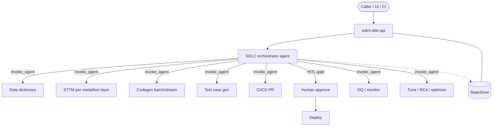
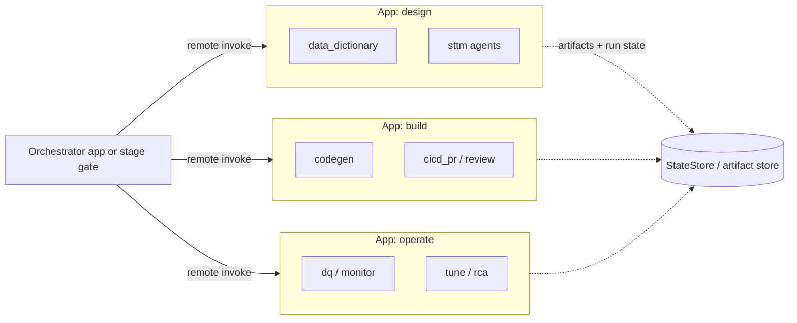
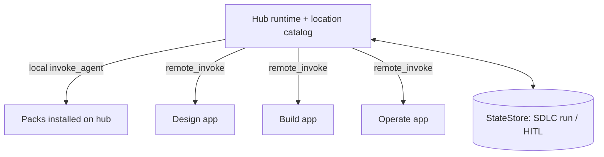
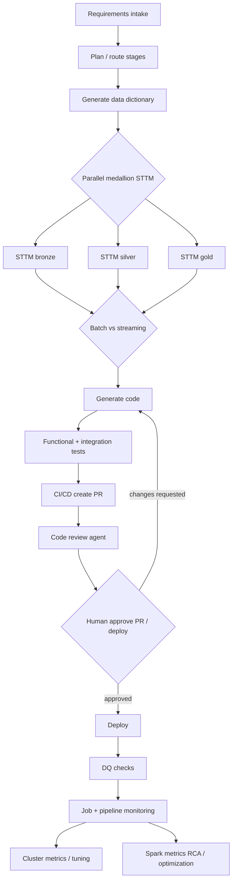
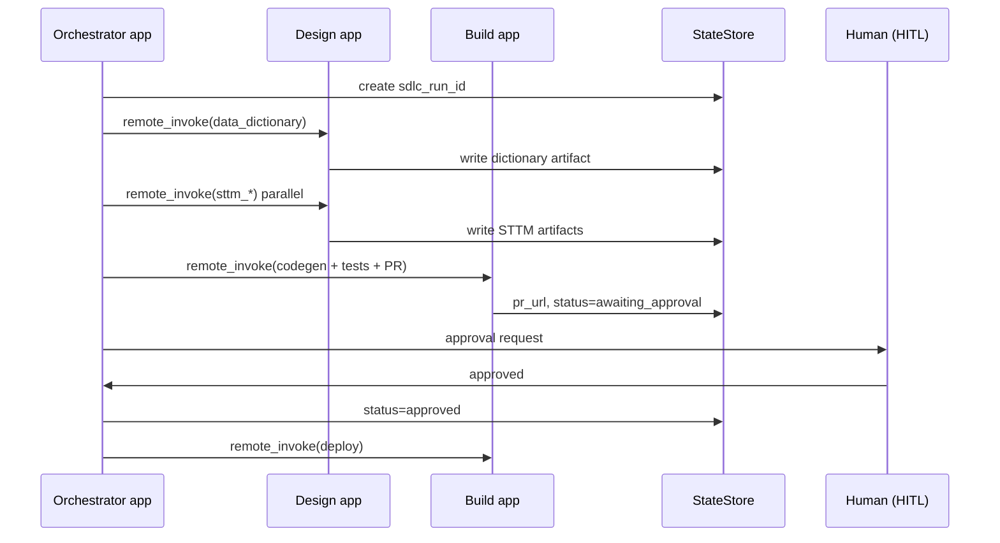

# Agent deployment & composition

**Learning path:** B9 · [Guide home](../README.md)  
**← Previous:** [Config → observability](config-to-observability.md) · **Next:** [Environments](../platform/environments.md) →

**This page covers:** how to **deploy** many YAML agents (one app vs many apps), how **end consumers** use the framework (full DE SDLC suite vs single-agent packs), and how agents **interact across apps** when topologies are split.

**Not on this page:**

| Topic | Go to |
|-------|--------|
| In-process `invoke_agent` node config | [Orchestration topology](../framework/orchestration-topology.md) |
| Packaging Apps / Docker / ACA | [Deploy & hosting](../api/deploy-and-hosting.md) |
| Identities U / A / B | [Access & permissions](../platform/access-and-permissions.md) |
| Session / catalog persistence | [State store](../platform/state-store.md) |

---

## 1. Product intent (two consumer modes)

The same framework must support both:

| Mode | Who | What they deploy |
|------|-----|------------------|
| **A — Full Data Engineering SDLC suite** | Platform / DE CoE | Many specialized agents that together run requirements → design → code → test → PR → HITL → deploy → DQ → monitor → tune / RCA |
| **B — Single use-case agent** | A business unit | One (or a few) agents for one job — e.g. only cluster tuning, or only STTM generation |

```text
┌─────────────────────────────────────────────────────────────────────────┐
│  EDIM framework (YAML + nodes + API runtime)                            │
│                                                                         │
│   ┌─ Consumer: DE SDLC suite ─────────────┐  ┌─ Consumer: single agent ┐│
│   │  many agents · long-lived state        │  │  one agent · one app    ││
│   │  sequential + parallel stages          │  │  minimal ops            ││
│   │  HITL gates · CI/CD · DQ · RCA         │  │                         ││
│   └────────────────────────────────────────┘  └─────────────────────────┘│
└─────────────────────────────────────────────────────────────────────────┘
```

**Principle:** agents are **packs** (YAML + optional nodes). The API is the **runtime**. Topology (one app vs many) is a **deploy choice**, not a YAML rewrite.

---

## 1b. Capability status matrix (Phase 0) — source of truth

Track what the **runtime supports today** vs what is **design-only**. Expand rows here (and mirror open work in [BACKLOG.md](../../BACKLOG.md) / platform BL-025 / BL-027) when capabilities land — do not rely on chat history.

| Capability | Status | Notes |
|------------|--------|--------|
| **Option A — single app, many agents** | **Supported** | One `edim-dde-api` + `bootstrap_agents` loads bundled + `EDIM_AGENT_DIRS` / entry-point packs into one registry |
| **In-process agent→agent** | **Supported** | Builtin `invoke_agent` (`agent_id`, I/O map, `max_depth`) — [Orchestration topology](../framework/orchestration-topology.md) |
| **Single-agent BU pack** | **Supported** | One pack on a shared runtime, or a small app that only loads that pack |
| **Option B — multiple apps by domain** | **Partial (ops only)** | Multiple Apps/ACA deploys with different packs are possible; **no** first-class cross-app YAML wiring |
| **Option C — hub + location catalog** | **Not supported** | No `local` / `remote` location map; StateStore catalog is metadata sync, not routing |
| **Cross-app `remote_invoke_agent`** | **Not supported** | Manual HTTP to another app’s API only |
| **Full DE SDLC orchestrator suite** | **Not shipped** | Documented target (§4); Phase 0 ships operate-style agents (`cluster_tuning`, `spark_rca`) |
| **Shared SDLC run state / HITL resume** | **Partial / later** | StateStore has session-shaped models; HITL interrupt/resume not a Phase 0 product flow |
| **Parallel fan-out across agents** | **Same-app only** | Via graph design / multiple `invoke_agent` nodes in one process — not a distributed orchestrator |

**Expand later without losing intent:** when implementing Option B/C or remote invoke, update this table’s Status/Notes first, then tick the matching backlog items (§8 Related + product/platform backlogs).

---

## 2. Deployment topologies

### Option A — Single app, many agents (default)

One `edim-dde-api` process bootstraps **all** agent packs into one in-process registry. Parent agents call children with **`invoke_agent`** (same process).

```text
                    ┌──────────────────────────────────────┐
                    │     edim-dde-api  (one deploy)       │
                    │                                      │
   HTTP invoke ──►  │  orchestrator.agent.yaml             │
                    │       │ invoke_agent (in-process)    │
                    │       ├─► data_dictionary            │
                    │       ├─► sttm_bronze / silver / gold │
                    │       ├─► codegen_batch|streaming    │
                    │       ├─► testgen · cicd_pr · review │
                    │       ├─► dq · monitor · tune · rca  │
                    │       └─► …                          │
                    │                                      │
                    │  StateStore (session / SDLC run id)  │
                    └──────────────────────────────────────┘
```



| | |
|--|--|
| **Typical use cases** | Full DE SDLC in one trust boundary; SDBX/DEV; single-agent BUs that still share one shared platform app; teams that want cheapest agent-to-agent calls |
| **Pros** | Simplest ops; in-process `invoke_agent`; one env/KV/LangSmith project; shared StateStore session for the whole SDLC run; easy sequential + parallel within one graph |
| **Cons** | Larger blast radius on release; harder if domains need **different** UC/IAM or release trains; one noisy neighbor can affect all agents |
| **Recommendation** | **Default** for Phase 0–1 and for most single-BU packs hosted on a shared platform runtime |

---

### Option B — Multiple apps by domain / use-case (selective)

Split into several `edim-dde-api` deployments when **boundaries** matter (ownership, data class, SLA, network, or independent release). Each app loads **only its** agent packs.

```text
┌─ App: design ────────┐  ┌─ App: build ──────────┐  ┌─ App: operate ─────┐
│ data_dictionary      │  │ codegen · tests · PR   │  │ dq · monitor       │
│ sttm_*               │  │ code_review (HITL)     │  │ tune · rca · opt   │
└──────────┬───────────┘  └──────────┬────────────┘  └─────────┬──────────┘
           │                         │                         │
           └──────────── cross-app HTTP / events ──────────────┘
                              (not in-process invoke_agent)
```



| | |
|--|--|
| **Typical use cases** | Design agents may not touch prod warehouses; build/CI agents need Git credentials; operate agents need live UC metrics; different domain teams own packs; compliance isolation |
| **Pros** | Isolation; independent scale and release; clearer IAM per app; product packaging (“Design suite” vs “Operate suite”) |
| **Cons** | More ops; **in-process `invoke_agent` cannot cross apps**; need remote contracts, auth, timeouts, correlation ids; shared **run state** must live outside any one process |
| **Recommendation** | Use **only when a real boundary exists**. Prefer few domain apps (design / build / operate), **not** one app per agent |

---

### Option C — Platform hub + domain satellites

A thin **orchestrator / catalog** runtime owns the SDLC parent flow and discovers where each logical `agent_id` lives (`local` vs `remote`). Domain apps host specialized packs.

```text
┌─ Hub (orchestrator + agent location catalog) ─────────────┐
│  sdlc_orchestrator.agent.yaml                             │
│  location map: agent_id → local | https://app-…/…         │
└────────────────────────────┬──────────────────────────────┘
           ┌─────────────────┼─────────────────┐
           ▼                 ▼                 ▼
      Design app        Build app         Operate app
```



| | |
|--|--|
| **Typical use cases** | Enterprise platform product; many BUs plug packs into a shared hub; mix of colocated and remote agents without rewriting YAML |
| **Pros** | Portable graphs (`agent_id` stable); consumers choose topology via catalog; hub stays thin if SQL/tools stay in satellites |
| **Cons** | Needs location catalog + remote invoke capability (later); hub can become a bottleneck if overloaded with work |
| **Recommendation** | Target shape for a **multi-team enterprise product**. Start with **Option A**, introduce **B** when splitting, add **C** when location config must be first-class |

---

## 3. Decision guide

| Question | Prefer |
|----------|--------|
| Same team, same UC/IAM, same release train? | **A** |
| Different data sensitivity, owners, or credentials (Git vs UC vs Foundry)? | **B** (few domain apps) |
| Selling a platform where tenants choose one vs many runtimes? | **C** (catalog) over time; **A** initially |
| BU wants one agent only? | **A** on a shared runtime *or* a tiny dedicated app with one pack — same framework |
| Interactive parent needs child in seconds and same trust zone? | Colocate (**A**) or same domain app |
| Long-running / HITL / CI waits? | Persist run in **StateStore**; resume across apps |

**Do not** default to one Databricks App / ACA per agent — ops cost without enough isolation benefit.

---

## 4. Full Data Engineering SDLC (reference flow)

Example stages (illustrative — not all exist as shipped agents yet). An orchestrator coordinates **sequential** gates and **parallel** fan-out, keeping **one SDLC run id** in StateStore.



| Concern | How it maps to EDIM |
|---------|---------------------|
| Sequential stages | Orchestrator edges / routers; or remote stage calls in Option B/C |
| Parallel stages | Fan-out nodes or parallel remote invokes; join before next gate |
| Shared state | **StateStore** keyed by `sdlc_run_id` (artifacts, decisions, PR url, approvals) — not only in-graph memory |
| HITL | Persist pending approval; resume invoke with human decision (interrupt / session — see roadmap HITL) |
| Same-app children | `invoke_agent` today |
| Cross-app children | Remote invoke / events (below) |

Phase 0 shipped examples (`cluster_tuning`, `spark_rca`) sit in the **operate** slice of this picture; the SDLC suite grows as additional packs.

---

## 5. Cross-app agent interaction

### 5.1 Rule

| Boundary | Mechanism |
|----------|-----------|
| **Same process** | `invoke_agent` — [Orchestration topology](../framework/orchestration-topology.md) |
| **Different apps** | **Remote contract** (HTTP sync and/or async events) — **not** in-process `invoke_agent` |

### 5.2 Patterns

#### Pattern 1 — Remote agent invoke (sync)

```text
App A orchestrator
  → POST https://app-b/.../agents/{agent_id}/invoke
       Authorization: MI / SP / gateway
       Headers: X-Request-Id / trace parent
       Body: contracted JSON (inputs)
  ← Body: contracted JSON (outputs) + status
```

Use for interactive or short child runs (dictionary, STTM slice, RCA).

#### Pattern 2 — Orchestrator hub (Option C)

Hub holds SDLC parent YAML; children resolved via **location map** (`local` | `remote`). Graphs stay portable.

#### Pattern 3 — Async / events

Publish “stage completed”; consumers continue. Prefer for CI waits, long codegen, monitoring loops.

#### Pattern 4 — Shared StateStore as the spine

All apps read/write the same `sdlc_run_id` record (artifacts, HITL status). Agents pass **pointers** (run id, artifact uris), not huge payloads on every hop.



### 5.3 Configuration model (deployment-agnostic YAML)

Keep YAML referencing **logical** `agent_id`. Bind **where** it runs in env/catalog (Option C; optional later):

```text
# Logical (agent YAML) — same in every topology
call_rca:
  type: invoke_agent          # or future remote_invoke_agent
  agent_id: spark_rca

# Physical (per env / catalog — not hard-coded per graph)
spark_rca:
  mode: local                 # Option A / same app
  # mode: remote
  # base_url: https://edim-operate..../
  # auth: managed_identity
  # timeout_sec: 120
```

| Today (Phase 0) | Later |
|-----------------|--------|
| All targets must be **registered in the same process** for `invoke_agent` | Location catalog + `remote_invoke_agent` (or standard HTTP tool) |
| Multi-app = separate deploys + manual HTTP integration | First-class remote node + discovery |

Canonical checklist: **[§1b Capability status matrix](#1b-capability-status-matrix-phase-0--source-of-truth)**.

### 5.4 Auth & observability across apps

- Each app keeps its own host identity ([Access & permissions](../platform/access-and-permissions.md)).
- Do not assume App A’s Databricks **user** token is valid on App B without an explicit OBO/gateway design.
- Propagate **correlation / request id** on every remote hop; one LangSmith (or linked) project per env when possible.

---

## 6. Single-agent business-unit deploy

```text
BU wants only "cluster tuning"
        │
        ▼
  Package: edim-agents-tuning (YAML + nodes)
        │
        ├─► Install into shared platform app (Option A)   ← preferred
        └─► Or dedicated small App with one pack (Option B mini)
```

| Approach | When |
|----------|------|
| Pack on shared runtime | Default — lowest cost, same smoke/ops |
| Dedicated mini-app | BU needs own network, secrets, or chargeback |

Same authoring path: [Agent package layout](../build-agents/agent-package-layout.md) · [External plugins](../build-agents/external-plugins.md).

---

## 7. Recommendations (summary)

1. **Default to Option A** (one runtime, many packs) for development and for most production suites that share trust/data.  
2. **Split with Option B** only at real boundaries (e.g. design vs build vs operate) — few apps, not one-per-agent.  
3. **Evolve toward Option C** when multiple consumers need the same graphs under different topologies.  
4. **SDLC state lives in StateStore** (`sdlc_run_id`); graphs orchestrate; HITL resumes from stored status.  
5. **Cross-app = remote contracts + shared state**; same-app = `invoke_agent`.  
6. **Ship agent packs** so BUs can take one agent or the full suite without forking the framework.

---

## 8. Related docs

| Doc | Topic |
|-----|--------|
| [Orchestration topology](../framework/orchestration-topology.md) | In-process `invoke_agent` |
| [Deploy & hosting](../api/deploy-and-hosting.md) | Host adapters (Apps / ACA) |
| [State store](../platform/state-store.md) | Catalog / sessions |
| [External plugins](../build-agents/external-plugins.md) | `EDIM_AGENT_DIRS` packs |
| [End-to-end design](end-to-end-design.md) | Planes and patterns |
| Product [BACKLOG](../../BACKLOG.md) · Platform [capability backlog](../../AI_Framework_Platform_Capability_Backlog.md) | HITL, remote invoke, routing |

<!-- edim-learning-nav -->
---

← [Config → observability](config-to-observability.md) · [Guide home](../README.md) · [Environments](../platform/environments.md) →
