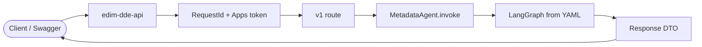
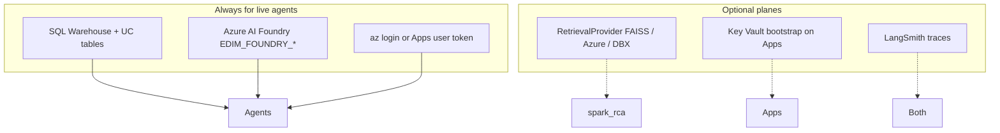

# Agents deep dive (E3a)

**Learning path:** E3a · [Guide home](../README.md)  
**← Previous:** [Bundled agents](bundled-agents.md) · **Next:** [Cluster tuning walkthrough](cluster-tuning-agent.md) →

This section is the **product walkthrough** for the two bundled agents: what they are for, every graph step from HTTP input to final DTO, Unity Catalog telemetry they read, and external add-ons (knowledge / RAG, Foundry, optional Databricks Knowledge Assistant).

---

## Pages in this section

| Page | Contents |
|------|----------|
| **This page** | How to read the section; shared dependencies |
| [Cluster tuning walkthrough](cluster-tuning-agent.md) | Full graph, guardrail retry, performance validation, response fields |
| [Spark RCA walkthrough](spark-rca-agent.md) | Multi-SQL collect → evidence → RAG → LLM → validate |
| [UC telemetry tables](uc-telemetry-tables.md) | Table FQNs + attribute meanings for tuning & RCA |
| [External add-ons](external-addons.md) | Knowledge plane, ingest, Foundry, Knowledge Assistant eval |

Short summary (still useful as a map): [Bundled agents](bundled-agents.md).

---

## What “an agent” means here

An **agent** is a versioned YAML graph (`*.agent.yaml`) plus registered Python node types and prompts/skills. The API does **not** invent business logic — it:

1. Validates the HTTP body (`TuningRequest` / `RcaRequest`)
2. Invokes `create_agent("<id>").invoke(state)` on a worker thread
3. Projects agent state into a stable OpenAPI DTO (`TuningResponse` / `RcaResponse`)

---

## Bundled agents at a glance

| Agent | HTTP | Job | Primary UC | LLM | Knowledge |
|-------|------|-----|------------|-----|-----------|
| `cluster_tuning` | `POST /api/v1/cluster_tuning/recommend` | Right-size job cluster SKU / workers | Job cluster metrics table | Sizing (+ optional explanation) | None in R1 |
| `spark_rca` | `POST /api/v1/rca/analyze` | Explain failed Spark run | Spark metrics + logs tables | RCA synthesize | `rag.retrieve` → `spark-runbooks` |

---

## Shared runtime dependencies

| Dependency | Used by | If missing |
|------------|---------|------------|
| Databricks SQL warehouse + table grants | Both (unless override) | 404/502/503 on collect |
| Foundry LLM | Both `llm_chain` nodes | 503 `FOUNDRY_LLM_NOT_CONFIGURED` |
| `EDIM_RETRIEVAL` + corpus index | `spark_rca` only | RCA still runs; empty runbook context |
| Key Vault | Apps Foundry secrets | Apps Foundry blocked until IAM |
| LangSmith | Ops debug | Agents still succeed |

---

## How to use the walkthroughs

1. Start with the **input contract** (what the client must send).
2. Follow the **graph diagram** (every node id = YAML node id).
3. Read **step cards** for state keys produced and side effects (SQL, LLM, clamp, retry).
4. Cross-check **UC attributes** on [UC telemetry tables](uc-telemetry-tables.md).
5. For knowledge / ingest / Brick eval, see [External add-ons](external-addons.md).

---

## Overrides (dry / CI)

| Agent | Override field | Skips |
|-------|----------------|-------|
| Tuning | `metrics` | `collect_metrics` SQL |
| RCA | `evidence_pack` | All five SQL collectors |

LLM nodes still execute (Foundry live, or `DomainStubLLM` in pytest).

---

← [Bundled agents](bundled-agents.md) · [Guide home](../README.md) · [Cluster tuning walkthrough](cluster-tuning-agent.md) →
