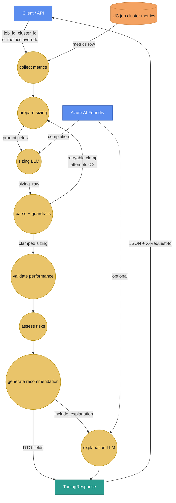
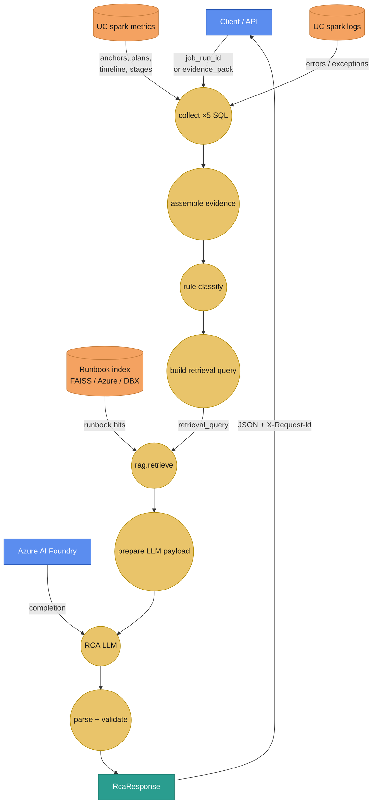

# Bundled agents (E3)

**Learning path:** E3 · [Preface](../README.md)  
**← Previous:** [SQL design deep dive](../DESIGN_SOURCES_AND_SQL_NODES.md) · **Next:** [Agents deep dive](agents-guide.md) →

## Chapter summary

Catalog of agents shipped in `edim-dde-domain` under `agents/` (`cluster_tuning`, `spark_rca`), following the standard package layout. Full node-by-node walkthroughs live in the agents deep-dive section.

**Outcome:** you know which bundled agents exist and where to open the detailed graphs.

---

Shipped inside `edim-dde-domain` under `agents/`. Both follow [agent package layout](../build-agents/agent-package-layout.md) (`helpers/`, `content/`).

> **Full walkthroughs** (input → every graph node → outputs, Mermaid diagrams, UC attributes, knowledge add-ons): start at **[Agents deep dive](agents-guide.md)**.

---

## Overview

| `agent_id` | Purpose | Highlights |
|------------|---------|------------|
| `cluster_tuning` | Job cluster sizing recommendations | SQL metrics → sizing LLM → guardrails → **optional 1 re-prompt** → performance validation → risk → recommendation |
| `spark_rca` | Spark job root-cause analysis | SQL telemetry → evidence → classify → **runbook retrieve (RAG)** → RCA LLM |
| `hitl_demo` | HITL pause / resume sample | `set_value` → `hitl.gate` → finish. No SQL/LLM. [HITL guide](../framework/hitl-resume.md) |

| Walkthrough | UC catalog | Add-ons |
|-------------|------------|---------|
| [Cluster tuning](cluster-tuning-agent.md) · [Spark RCA](spark-rca-agent.md) | [UC telemetry tables](uc-telemetry-tables.md) | [External add-ons](external-addons.md) |

---

## Quick flow diagrams (DFD-style)

Legend: **blue** = external actor / system · **orange rectangle** = data store · **gold circle** = process step · arrows are labeled with what moves.

### `cluster_tuning`

### `spark_rca`

Detail with every YAML node id: [Cluster tuning](cluster-tuning-agent.md) · [Spark RCA](spark-rca-agent.md).

---

## Overrides for offline runs

| Agent | Field | Effect |
|-------|-------|--------|
| Tuning | `metrics` | Skip SQL collect |
| RCA | `evidence_pack` | Skip SQL collectors |

LLM nodes still run (use Foundry or test stub).

HTTP contracts: [endpoints](../api/endpoints.md).

---

## Summary

- Two product agents ship in-domain; both follow package layout conventions.
- Dry overrides skip SQL; HTTP contracts are on the API endpoints page.

**Next →** [Agents deep dive (E3a)](agents-guide.md)

← [SQL design deep dive](../DESIGN_SOURCES_AND_SQL_NODES.md) · [Preface](../README.md) · [Agents deep dive](agents-guide.md) →
