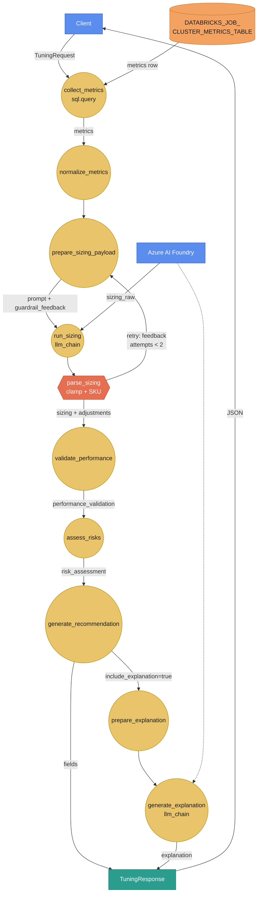
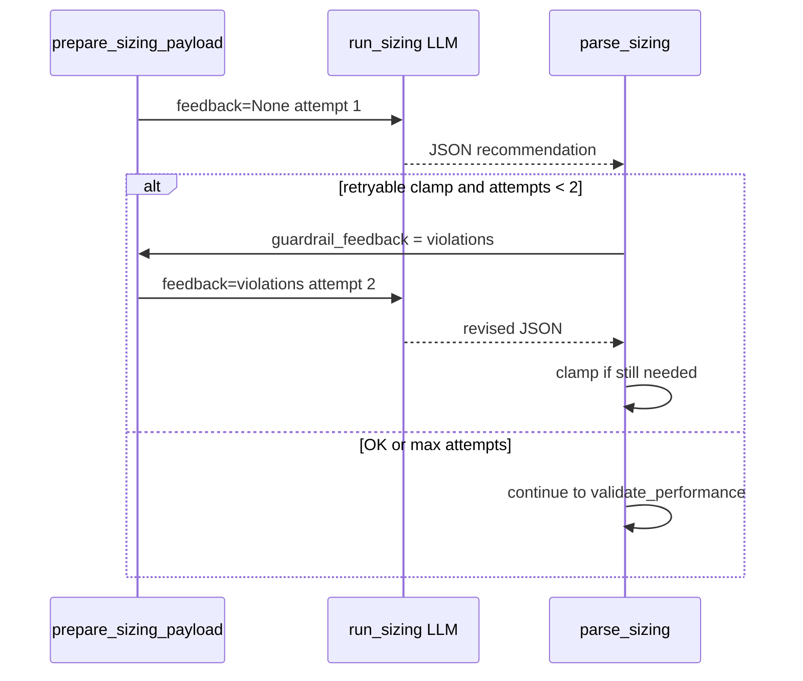

# Cluster tuning agent — full walkthrough (E3b)

**Learning path:** E3b · [Preface](../README.md)  
**← Previous:** [Agents deep dive](agents-guide.md) · **Next:** [Spark RCA walkthrough](spark-rca-agent.md) →

## Chapter summary

This chapter walks through the **`cluster_tuning`** agent end to end: UC metrics (or a `metrics` override), Foundry sizing, deterministic guardrails, performance/risk steps, and the stable `TuningResponse`. Use it when you need to debug the graph, extend pressure policy, or call the recommend API with confidence.

**Audience:** platform / data engineers and domain authors. **Outcome:** you can trace each node, supply dry overrides, and interpret guardrail retries and recommendation fields.

## Prerequisites

| Requirement | Notes |
|-------------|-------|
| [Bundled agents (E3)](bundled-agents.md) | Agent map and registration |
| [Agents deep dive (E3a)](agents-guide.md) | Shared dependencies hub |
| [Sources and SQL (E1)](sources-and-sql.md) | Named source `edim_sql_wh` |
| Foundry (live HTTP) | Sizing / optional explanation LLM — [Configuration (G1)](../api/configuration.md) |

**Agent id:** `cluster_tuning`  
**Package path:** `edim_dde_domain/agents/cluster_tuning/`  
**HTTP:** `POST /api/v1/cluster_tuning/recommend`  
**YAML:** `cluster_tuning.agent.yaml`

---

## 1. What this agent is for

Platform / data engineers ask: *“Given how this Databricks job cluster actually behaved on a recent run, what SKU and autoscale bounds should we use next?”*

The agent:

1. Loads **one row** of job-cluster telemetry from Unity Catalog (or accepts a `metrics` override).
2. Asks a **sizing LLM** (Foundry) for `node_family`, `vcpus`, worker bounds, and rationale.
3. Applies **deterministic guardrails** (clamp + SKU allow-list); optionally **re-prompts once** if the model violated policy.
4. Runs **rule-based performance validation** and **risk assessment**.
5. Returns a stable **`TuningResponse`** (never the raw agent state bag).

**Historical context (RAG + store + experience index):** before sizing, the graph retrieves optional guidance (`corpus: cluster-tuning-guidance`), similarity-searches **past experiences** (`corpus: cluster-tuning-outcomes` — resource-feature/action cards derived from RecommendationStore writes), and merges a thin **same-`job_id`** shelf from the store into `{historical_context}`. Cross-job learning is **feature-based**, not `job_id`-based; heuristic peer ranking is only a cold-start fallback when the experience index is empty. With `EDIM_RETRIEVAL=none` and an empty store, the prompt still gets `None` and sizing proceeds. Details: [Retrieval & RAG §6b–6c](../platform/retrieval-and-rag.md#6b-cluster_tuning-historical-context).

---

## 2. Input (HTTP → agent state)

| Field | Required | Meaning |
|-------|----------|---------|
| `job_id` | Yes | Databricks job id used in the UC `WHERE` clause |
| `cluster_id` | Yes* | Job cluster id filter (*SQL allows null; API currently requires it) |
| `job_run_id` | No | Pin a specific run; otherwise latest matching row |
| `start_date` / `end_date` | No | Bound `job_run_date` (`YYYY-MM-DD`) |
| `workspace_id` | No | Within-env workspace for warehouse/UC FQNs ([resolver](workspace-resolver.md)) |
| `include_explanation` | No | If true, second LLM call explains the recommendation |
| `metrics` | No | Full metrics object → **skip SQL** |

### What `metrics` is (and where it comes from)

**`metrics`** is one job-cluster telemetry row (SKU, peak CPU/memory, provisioned
workers, etc.) used for sizing. It is **not** an RCA `evidence_pack`.

| Source | Typical use |
|--------|-------------|
| **Read from Databricks UC** | Production: `job_id` / `cluster_id` and **no** `metrics` → `collect_metrics` SQL runs |
| **Sent in the request body** | Dry API / demos: client supplies `metrics` → SQL skipped; sizing LLM still runs |
| **JSON under `testdata/quality/`** | Quality corpus / harness: metrics (and often a frozen recommendation `output`) come from case files |

```text
Prod:     { job_id, cluster_id }     → live SQL → real metrics → Foundry sizing
Dry API:  { job_id, cluster_id, metrics } → skip SQL → Foundry
Harness:  case JSON metrics/output   → score fixture  or  invoke + Foundry (SQL usually skipped)
```

Same three-source model as RCA: [Evaluation & quality §5b](../framework/evaluation-and-quality.md#5b-where-evidence--metrics-come-from-prod-vs-smoke).

!!! tip "Pro tip — dry vs live metrics"
    Supply `metrics` in the request to skip warehouse SQL while still exercising Foundry sizing and guardrails. Omit `metrics` only when you intend a live UC read.

Also accepted at the HTTP layer: optional `X-Request-Id` (echoed; tags LangSmith / logs).

Example (dry — no warehouse):

```bash
curl -s localhost:8080/api/v1/cluster_tuning/recommend \
  -H 'content-type: application/json' \
  -H 'X-Request-Id: guide-tuning-1' \
  -d '{
    "job_id": "j-1",
    "cluster_id": "c-1",
    "include_explanation": false,
    "metrics": {
      "azure_worker_vm_size": "Standard_E8s_v3",
      "max_worker_nodes_provisioned": 16,
      "avg_worker_nodes_consumed": 4.0,
      "p99_worker_nodes_consumed": 5.0,
      "peak_worker_cpu_utilization_pct": 20,
      "peak_worker_memory_utilization_pct": 25,
      "avg_worker_cpu_utilization_pct": 15,
      "avg_worker_memory_utilization_pct": 18,
      "driver_node_count": 1
    }
  }'
```

UC column meanings: [UC telemetry tables](uc-telemetry-tables.md#job-cluster-metrics).

---

## 3. End-to-end graph (DFD-style)

Circles = graph processes · orange boxes = data stores / side systems · blue = client · teal = API response. Arrow labels = data exchanged.



**Legend**

| Shape / path | Meaning |
|--------------|---------|
| `domain.sql.query` | Warehouse read (skipped if `metrics` already in state) |
| `llm_chain` | Foundry / stub LLM |
| Loop back to `prepare_sizing_payload` | Guardrail **retry** (max 2 sizing calls) |
| Branch after `generate_recommendation` | Optional explanation LLM |

---

## 4. Step-by-step

### Step A — `collect_metrics` (`domain.sql.query`)

| | |
|--|--|
| **Source** | Named source `edim_sql_wh` |
| **Table** | `${DATABRICKS_JOB_CLUSTER_METRICS_TABLE}` |
| **Mode** | `first_row` → state key `metrics` |
| **Empty** | `on_empty: error` → API maps to 404 `NoJobMetricsError` |

Reads the latest matching job/cluster run (see SELECT in YAML). Auth: Apps user token or local `az login` — [Auth and SQL](../architecture/auth-and-sql.md).

!!! warning "Empty metrics → 404"
    With live SQL and no matching row, `on_empty: error` maps to **404** `NoJobMetricsError`. Confirm `job_id` / `cluster_id` (and optional date bounds) against the UC table before debugging the LLM path.

### Step B — `normalize_metrics`

Ensures `job_id`, `cluster_id`, `job_run_id`, and `metrics` are consistent after SQL or override.

### Step C — `prepare_sizing_payload`

Builds **string** prompt fields:

| State key | Content |
|-----------|---------|
| `current_config` | Current SKU / max workers / DBR snippet |
| `job_run_ingest` | Full metrics JSON |
| `sizing_hints` | Deterministic worker bounds plus the YAML-configured resource-pressure profile |
| `guardrail_feedback` | `"None"` on first pass; violation list on **retry** |
| `historical_context` | Experience-index hits (feature similarity over past outcomes) + same-`job_id` store shelf + optional retrieved guidance; `"None"` when all empty. See [Retrieval & RAG §6b–6c](../platform/retrieval-and-rag.md#6b-cluster_tuning-historical-context) |

### Step D — `run_sizing` (`llm_chain` / chain `sizing`)

Calls Foundry with system + human prompts and all tuning skills (historical-context
usage, resource-pressure method, VM-family rules, SKU allow-list, output schema).
Writes raw model text to `sizing_raw`.

**Decision hierarchy:** live metrics → deterministic sizing hints → similar past
experiences → same-job history → human guidance. Lower-priority evidence can
corroborate but never override current metrics.

!!! tip "Pro tip — historical context is optional"
    With `EDIM_RETRIEVAL=none` and an empty RecommendationStore, `{historical_context}` is still `"None"` and sizing proceeds. Do not treat missing RAG as a hard failure.

The model must compare every configured pressure dimension, keep utilization
separate from failure evidence, and avoid family changes unless a supported
limiting-resource shape mismatch exists. It must include
`### 5. Historical evidence` stating which history supported the decision or why
none was used. Repeated experience patterns (`occurrences=N`) are stronger
corroboration only when pressure features and limiting resource match.

#### YAML-configured pressure policy

`prepare_sizing_payload.resource_pressure` in `cluster_tuning.agent.yaml` is
**node-local config** — opaque to the framework and read only by this node's
factory (see [Nodes and routers §5–6](../framework/nodes-and-routers.md#5-node-local-config-is-opaque-to-the-framework)).
It declares:

- global target utilization, capacity buffer, and minimum level for shape change;
- dimensions based on one or more metric keys, or a numerator/denominator ratio;
- a `role` of `resource` (contributes to limiting-resource selection) or
  `capacity` (drives worker-bound direction and headroom);
- `low_below`, `high_at`, and `saturated_at` thresholds per dimension;
- optional Azure family preferences for a limiting resource.

```yaml
- id: prepare_sizing_payload
  type: domain.tuning.prepare_sizing_payload
  # …history_* knobs…
  resource_pressure:
    target_utilization_pct: 90
    capacity_buffer_pct: 10
    shape_change_min_level: high      # limiting pressure must reach this to move shape
    dimensions:
      cpu:
        role: resource
        metric_keys: [peak_worker_cpu_utilization_pct, peak_driver_cpu_utilization_pct]
        thresholds: {low_below: 40, high_at: 70, saturated_at: 85}
        preferred_families: [F, D]
      memory:
        role: resource
        metric_keys: [peak_worker_memory_utilization_pct, avg_driver_memory_utilization_pct]
        thresholds: {low_below: 40, high_at: 70, saturated_at: 90}
        preferred_families: [E]
      worker_capacity:
        role: capacity
        ratio: {numerator_key: avg_worker_nodes_consumed, denominator_key: max_worker_nodes_provisioned, scale: 100}
        thresholds: {low_below: 40, high_at: 70, saturated_at: 90}
```

The current YAML defines CPU, memory, and worker-capacity dimensions. They are
initial configuration, not a fixed scenario taxonomy. `compute_resource_pressure`
iterates the configuration and emits, per dimension, `value_pct` + `level`
(`low` / `moderate` / `high` / `saturated`) plus a derived `limiting_resource`,
`capacity_headroom`, and `preferred_families`. A future disk, network, spill, or
other dimension is a YAML addition once its metrics exist — no engine change.

**Single source of truth.** The node resolves the policy once and writes it to
state as `resource_pressure_config`. Every later consumer reads that state key
instead of re-reading YAML, so prompt hints and hard clamps cannot drift:

| Consumer | Uses the policy for |
|----------|---------------------|
| `run_sizing` prompt (`sizing_hints`) | pressure levels, limiting resource, suggested family |
| `parse_sizing` guardrails | worker floor from `capacity_buffer_pct` |
| `validate_performance` | peak target and floor ratio |
| `assess_risks` | elevated-pressure vs capacity-cut mitigation |
| experience index + `cluster_tuning.quality` | consistent labels/direction (loaded once at bootstrap for these non-graph consumers) |

High utilization means pressure only. It does not mean OOM, throttling, spill,
or job failure. Those claims require explicit event/error evidence, potentially
provided later through a separate RCA evidence channel.

??? note "In depth (optional) — design rationale, full parameter reference, and extending without code"

    Read this only if you need to change or extend the pressure policy. Day-to-day
    tuning does not require it.

    **Why pressure axes instead of named scenarios.** An earlier design hard-coded
    `over_provisioned` / `under_provisioned` / `oom_or_memory_pressure` as a closed
    enum across regexes, prompts, guidance files, indexing, and the evaluator.
    Adding a concern meant editing five places, and "OOM" was inferred from high
    memory even on runs that never failed. The pressure model fixes both problems:

    - **Dimensions are data.** Each dimension is a measurement + thresholds, so
      scenarios *emerge* (all low + high headroom ≈ over-provisioned; a saturated
      resource ≈ under-provisioned) instead of being enumerated.
    - **Pressure ≠ failure.** Utilization only yields a pressure `level`. OOM,
      spill, throttling, and job failure are separate **event evidence**, never
      synthesized from a percentage. That keeps a completed high-memory run from
      being mislabelled as an OOM.
    - **Roles separate two questions.** `capacity` answers *how many workers*;
      `resource` answers *what shape* (which family). They are computed
      independently so a capacity change and a family change each need their own
      evidence.

    **Full parameter reference.**

    | Key | Scope | Meaning | Omitted / invalid |
    |-----|-------|---------|-------------------|
    | `target_utilization_pct` | policy | Peak target; also `validate_performance` high-peak line | Defaults to 90 |
    | `capacity_buffer_pct` | policy | Head-room added to observed demand for the worker floor | Defaults to 10 |
    | `shape_change_min_level` | policy | Minimum limiting-resource `level` before a family/shape move is justified | Defaults to `high` |
    | `dimensions.<name>` | dimension | Logical axis name; also the label prefix (`<name>_pressure_<level>`) | — |
    | `role` | dimension | `resource` (limiting-resource candidate) or `capacity` (worker direction + headroom) | Defaults to `resource` |
    | `metric_keys` | dimension | One or more ingest keys; aggregated by `aggregation` (`max` default, or `mean`) | Dimension level = `unknown`, skipped |
    | `ratio` | dimension | `{numerator_key, denominator_key, scale}` instead of `metric_keys` | Missing/zero denominator → `unknown` |
    | `thresholds` | dimension | `low_below` ≤ `high_at` ≤ `saturated_at`; maps value → level | Out-of-order raises; unset uses 40/70/90 |
    | `preferred_families` | dimension | Families that satisfy this resource when it is limiting | Empty → shape move for that resource not asserted |

    Level mapping: `value < low_below → low`, `< high_at → moderate`,
    `< saturated_at → high`, `≥ saturated_at → saturated`. Capacity headroom is the
    inverse of capacity pressure (`low → high` headroom, `saturated → none`).

    **Worked recipe — add a "disk / spill" dimension without touching Python.**

    1. Confirm the metric already exists in `collect_metrics` output (e.g.
       `peak_worker_disk_utilization_pct`). *If it does not, this step needs SQL /
       ingest work — that is the code/content boundary, see below.*
    2. Add a dimension under `resource_pressure.dimensions`:

        ```yaml
        disk:
          role: resource
          metric_keys: [peak_worker_disk_utilization_pct]
          thresholds: {low_below: 40, high_at: 75, saturated_at: 90}
          preferred_families: [L]
        ```

    3. Nothing else changes: `compute_resource_pressure` iterates it, hints/labels/
       guardrails/evaluator all read the resolved profile from state, and experience
       cards start emitting `disk_pressure_*` / `limiting_resource_disk`.

    **The honest "no code changes" boundary.** YAML alone covers thresholds, roles,
    aggregation, new dimensions over *existing* metrics, buffers, and the shape-change
    gate. You still need code or content when you:

    - introduce a **new metric column** (SQL SELECT in `collect_metrics` + ingest);
    - add a **new VM family** beyond `D/E/F/L` (guardrail allow-list is a hard
      guardrail, not YAML);
    - want **prose guidance** for a new axis in retrieval (add a
      `knowledge/cluster-tuning-guidance/` doc and re-index);
    - change **how** a level maps to an action verb (that logic is deliberately
      generic and rarely needs editing).

    **`history_*` knobs (same node, different concern).** These tune historical
    context, not sizing math: `history_job_top_n` / `history_similar_top_n` /
    `history_candidate_limit` size the same-job and heuristic shelves;
    `history_prefer_statuses` orders them; `history_experience_top_k` /
    `history_experience_corpus` control the feature-similarity search; and
    `history_heuristic_fallback` disables heuristic peers once the experience index
    is warm. Full model: [Retrieval & RAG §6b–6c](../platform/retrieval-and-rag.md#6b-cluster_tuning-historical-context).

**Cost:** one completion per attempt (retry = second completion).

### Step E — `parse_sizing` (guardrails)

1. Parse JSON from `sizing_raw` (supports legacy key aliases).
2. **`validate_and_clamp_with_adjustments`**: family/vCPU/worker bounds, sizing floor/ceiling, auto-termination → 0, nearest allowed Azure SKU.
3. Increment `sizing_attempts`.
4. If **retryable** adjustments remain and attempts &lt; 2 → set `sizing_needs_retry=true` and format `guardrail_feedback`; graph routes back to Step C.
5. Else continue with clamped `sizing` + `guardrail_adjustments`.

**Retryable reasons** (re-prompt): invalid family, vCPU/worker range, sizing floor/ceiling, auto-termination policy, …  
**Not retryable:** deterministic `sku_mapped` alone (LLM does not output `azure_node_type`).

Response transparency: `sizing_attempts`, `guardrail_retries`, `guardrail_adjustments`.

!!! tip "Pro tip — read guardrail fields first"
    When the SKU looks “wrong,” check `guardrail_adjustments` and `sizing_attempts` before re-prompting. Deterministic clamps often explain the final numbers without another LLM call.

### Quality evaluation (offline / CI)

After invocation, `cluster_tuning.quality` can score the agent state using the
framework evaluator registry:

```python
from edim_dde_ai.evaluation import evaluate

result = evaluate(
    "cluster_tuning.quality",
    inputs={"metrics": request_metrics},
    output=agent_state,
    context={
        "historical_context": agent_state.get("historical_context"),
        "resource_pressure_config": yaml_pressure_config,
    },
)
```

It returns a 0–1 quality score, evidence-based confidence, dimension scores
(contract/evidence/direction/history/safety), and findings. Confidence measures
input/rubric coverage—not the LLM's claimed certainty. See
[Evaluation, quality, and confidence](../framework/evaluation-and-quality.md).

### Step F — `validate_performance` (no LLM)

Peak-load fitness vs current capacity:

- Recommended capacity ≥ ~80% of current (vCPU × max workers)
- `max_workers` ≥ sizing floor from ingest
- High peak util (~&gt;90%) blocks aggressive cuts

Writes `performance_validation` (`meets_peak_requirements`, `estimated_impact`, `reasons`, …).

### Step G — `assess_risks`

Combines capacity-change magnitude, peak util, and performance validation into `risk_assessment` (`risk_level`, mitigations, …).

### Step H — `generate_recommendation`

Builds:

- `recommendation` (SKU, workers, optimization %, risk, reason codes)
- `comparison` (current vs recommended capacity)
- May append `PERFORMANCE_DEGRADATION_RISK` when validation failed

### Step I — optional explanation

If `include_explanation` is truthy: `prepare_explanation_payload` → `generate_explanation` (`llm_chain` / `explanation`) → `explanation` string.

!!! note "Explanation is a second LLM call"
    Set `include_explanation: false` for cheaper smoke runs. That skips only the explanation chain — sizing still requires Foundry (or a stub in tests).

---

## 5. Output (`TuningResponse`)

| Field | Meaning |
|-------|---------|
| `recommendation` | Applied sizing + optimization + risk_level + reason_codes |
| `current_configuration` / `comparison` | Before/after capacity view |
| `risk_assessment` | Level, magnitude, mitigations |
| `performance_validation` | Peak fitness object |
| `guardrail_adjustments` | Final clamps after last sizing attempt |
| `sizing_attempts` / `guardrail_retries` | LLM call counts |
| `job_cluster_metrics` | Metrics used (SQL or override) |
| `pattern_analysis` | From sizing LLM |
| `explanation` | Optional narrative |
| `recommendation_id` / `recommendation_status` | Set when history store persists the row |
| `request_id` | Correlation |

OpenAPI: `/docs` when the API is up. Contract notes: [HTTP endpoints](../api/endpoints.md).  
History backends: [Recommendation store](../platform/recommendation-store.md).

---

## 6. Guardrails & retry (detail)



---

## 7. External dependencies (this agent)

| Dependency | Role |
|------------|------|
| UC job cluster metrics table | Live telemetry |
| SQL warehouse + grants | Collect |
| Azure AI Foundry | Sizing / explanation LLM |
| LangSmith (optional) | Trace spans tagged with `agent_id`, `request_id` |
| RecommendationStore | Persist / list / status (Postgres local · Cosmos deploy) |
| RetrievalProvider | Optional guidance corpus `cluster-tuning-guidance` |
| Knowledge / RAG | Guidance markdown under `knowledge/cluster-tuning-guidance/` |

See [External add-ons](external-addons.md).

---

## 8. Source map

| Concern | Location |
|---------|----------|
| Graph | `agents/cluster_tuning/cluster_tuning.agent.yaml` |
| Nodes | `agents/cluster_tuning/nodes.py` + `logic.py` |
| Historical context | `helpers/historical_context.py` (experience search + store + RAG merge) |
| Experience transform | `helpers/experience_transform.py` (pressure/action index parser) |
| Guardrails | `helpers/guardrails.py` |
| Performance | `helpers/validate_performance.py` |
| Sizing policy | `helpers/sizing_policy.py` |
| SKU allow-list | `helpers/sku_allowlist.py` |
| Prompts / skills | `content/prompts/`, `content/skills/` |

---

## Troubleshooting

| Symptom | Likely cause | Fix |
|---------|--------------|-----|
| **404** `NoJobMetricsError` | No UC row for `job_id` / `cluster_id` | Verify filters or supply a `metrics` override |
| **503** Foundry not configured | Missing Azure OpenAI / Foundry env | Configure per [Configuration (G1)](../api/configuration.md) |
| Unexpected SKU / workers | Guardrail clamp or allow-list map | Inspect `guardrail_adjustments`, `sizing_attempts` |
| No historical guidance in prompt | `EDIM_RETRIEVAL=none` or empty corpora/store | Expected cold start — sizing still runs with `"None"` |
| Slow / expensive calls | `include_explanation: true` | Set false unless you need the narrative |
| SQL auth failures on Apps | Signed-in user lacks warehouse/UC grants | See [Access & permissions (C2b)](../platform/access-and-permissions.md) |

---

## Summary

- `cluster_tuning` loads one metrics row (SQL or override), sizes via Foundry, then applies deterministic guardrails and risk/performance checks.
- Historical context (RAG + experience index + same-job shelf) is optional corroboration — never overrides live metrics.
- Response is always a stable `TuningResponse`, not the raw agent state bag.
- **Next →** [Spark RCA walkthrough (E3c)](spark-rca-agent.md)

← [Agents deep dive](agents-guide.md) · [Spark RCA walkthrough](spark-rca-agent.md) →
