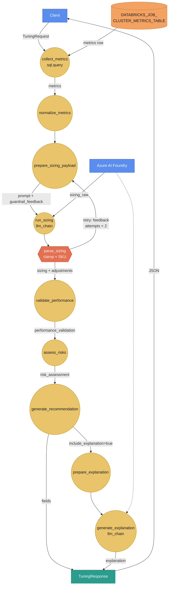
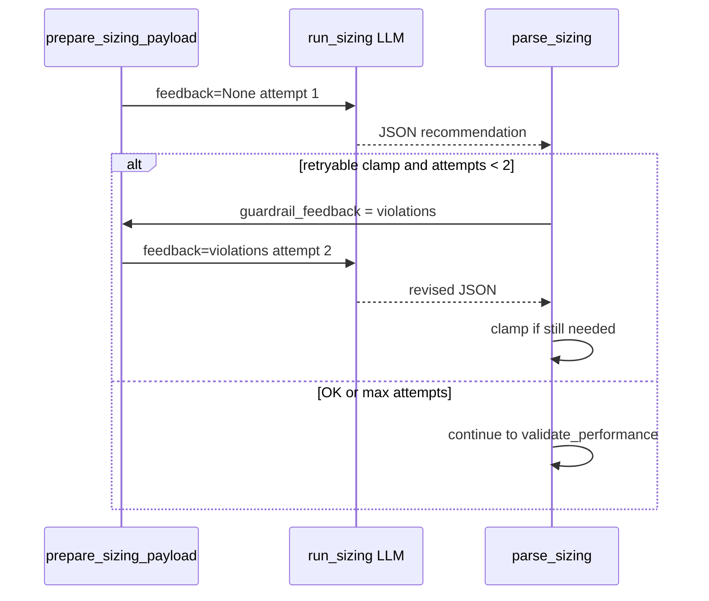

# Cluster tuning agent — full walkthrough (E3b)

**Learning path:** E3b · [Guide home](../README.md)  
**← Previous:** [Agents deep dive](agents-guide.md) · **Next:** [Spark RCA walkthrough](spark-rca-agent.md) →

**Agent id:** `cluster_tuning`  
**Package path:** `edim_dde_domain/agents/cluster_tuning/`  
**HTTP:** `POST /api/v1/cluster_tuning/recommend`  
**YAML:** `cluster_tuning.agent.yaml`

---

## 1. What this agent is for

Platform / data engineers ask: *“Given how this Databricks job cluster actually behaved on a recent run, what SKU and autoscale bounds should we use next?”*

The agent:

1. Loads **one row** of job-cluster telemetry from Unity Catalog (or accepts a `metrics` override).
2. Asks a **sizing LLM** (Foundry) for `node_family`, `vcpus`, worker bounds, and rationale.
3. Applies **deterministic guardrails** (clamp + SKU allow-list); optionally **re-prompts once** if the model violated policy.
4. Runs **rule-based performance validation** and **risk assessment**.
5. Returns a stable **`TuningResponse`** (never the raw agent state bag).

It does **not** apply cluster changes, write back to Databricks, or use RAG.

---

## 2. Input (HTTP → agent state)

| Field | Required | Meaning |
|-------|----------|---------|
| `job_id` | Yes | Databricks job id used in the UC `WHERE` clause |
| `cluster_id` | Yes* | Job cluster id filter (*SQL allows null; API currently requires it) |
| `job_run_id` | No | Pin a specific run; otherwise latest matching row |
| `start_date` / `end_date` | No | Bound `job_run_date` (`YYYY-MM-DD`) |
| `include_explanation` | No | If true, second LLM call explains the recommendation |
| `metrics` | No | Full metrics object → **skip SQL** |

Also accepted at the HTTP layer: optional `X-Request-Id` (echoed; tags LangSmith / logs).

Example (dry — no warehouse):

```bash
curl -s localhost:8080/api/v1/cluster_tuning/recommend \
  -H 'content-type: application/json' \
  -H 'X-Request-Id: guide-tuning-1' \
  -d '{
    "job_id": "j-1",
    "cluster_id": "c-1",
    "include_explanation": false,
    "metrics": {
      "azure_worker_vm_size": "Standard_E8s_v3",
      "max_worker_nodes_provisioned": 16,
      "avg_worker_nodes_consumed": 4.0,
      "p99_worker_nodes_consumed": 5.0,
      "peak_worker_cpu_utilization_pct": 20,
      "peak_worker_memory_utilization_pct": 25,
      "avg_worker_cpu_utilization_pct": 15,
      "avg_worker_memory_utilization_pct": 18,
      "driver_node_count": 1
    }
  }'
```

UC column meanings: [UC telemetry tables](uc-telemetry-tables.md#job-cluster-metrics).

---

## 3. End-to-end graph (DFD-style)

Circles = graph processes · orange boxes = data stores / side systems · blue = client · teal = API response. Arrow labels = data exchanged.



**Legend**

| Shape / path | Meaning |
|--------------|---------|
| `domain.sql.query` | Warehouse read (skipped if `metrics` already in state) |
| `llm_chain` | Foundry / stub LLM |
| Loop back to `prepare_sizing_payload` | Guardrail **retry** (max 2 sizing calls) |
| Branch after `generate_recommendation` | Optional explanation LLM |

---

## 4. Step-by-step

### Step A — `collect_metrics` (`domain.sql.query`)

| | |
|--|--|
| **Source** | Named source `edim_sql_wh` |
| **Table** | `${DATABRICKS_JOB_CLUSTER_METRICS_TABLE}` |
| **Mode** | `first_row` → state key `metrics` |
| **Empty** | `on_empty: error` → API maps to 404 `NoJobMetricsError` |

Reads the latest matching job/cluster run (see SELECT in YAML). Auth: Apps user token or local `az login` — [Auth and SQL](../architecture/auth-and-sql.md).

### Step B — `normalize_metrics`

Ensures `job_id`, `cluster_id`, `job_run_id`, and `metrics` are consistent after SQL or override.

### Step C — `prepare_sizing_payload`

Builds **string** prompt fields:

| State key | Content |
|-----------|---------|
| `current_config` | Current SKU / max workers / DBR snippet |
| `job_run_ingest` | Full metrics JSON |
| `sizing_hints` | Deterministic 90% util / 10% buffer hints |
| `guardrail_feedback` | `"None"` on first pass; violation list on **retry** |
| `historical_context` | Reserved (`"None"` in R1) |

### Step D — `run_sizing` (`llm_chain` / chain `sizing`)

Calls Foundry with system + human prompts and skills (SKU allow-list skill text, output schema). Writes raw model text to `sizing_raw`.

**Cost:** one completion per attempt (retry = second completion).

### Step E — `parse_sizing` (guardrails)

1. Parse JSON from `sizing_raw` (supports legacy key aliases).
2. **`validate_and_clamp_with_adjustments`**: family/vCPU/worker bounds, sizing floor/ceiling, auto-termination → 0, nearest allowed Azure SKU.
3. Increment `sizing_attempts`.
4. If **retryable** adjustments remain and attempts &lt; 2 → set `sizing_needs_retry=true` and format `guardrail_feedback`; graph routes back to Step C.
5. Else continue with clamped `sizing` + `guardrail_adjustments`.

**Retryable reasons** (re-prompt): invalid family, vCPU/worker range, sizing floor/ceiling, auto-termination policy, …  
**Not retryable:** deterministic `sku_mapped` alone (LLM does not output `azure_node_type`).

Response transparency: `sizing_attempts`, `guardrail_retries`, `guardrail_adjustments`.

### Step F — `validate_performance` (no LLM)

Peak-load fitness vs current capacity:

- Recommended capacity ≥ ~80% of current (vCPU × max workers)
- `max_workers` ≥ sizing floor from ingest
- High peak util (~&gt;90%) blocks aggressive cuts

Writes `performance_validation` (`meets_peak_requirements`, `estimated_impact`, `reasons`, …).

### Step G — `assess_risks`

Combines capacity-change magnitude, peak util, and performance validation into `risk_assessment` (`risk_level`, mitigations, …).

### Step H — `generate_recommendation`

Builds:

- `recommendation` (SKU, workers, optimization %, risk, reason codes)
- `comparison` (current vs recommended capacity)
- May append `PERFORMANCE_DEGRADATION_RISK` when validation failed

### Step I — optional explanation

If `include_explanation` is truthy: `prepare_explanation_payload` → `generate_explanation` (`llm_chain` / `explanation`) → `explanation` string.

---

## 5. Output (`TuningResponse`)

| Field | Meaning |
|-------|---------|
| `recommendation` | Applied sizing + optimization + risk_level + reason_codes |
| `current_configuration` / `comparison` | Before/after capacity view |
| `risk_assessment` | Level, magnitude, mitigations |
| `performance_validation` | Peak fitness object |
| `guardrail_adjustments` | Final clamps after last sizing attempt |
| `sizing_attempts` / `guardrail_retries` | LLM call counts |
| `job_cluster_metrics` | Metrics used (SQL or override) |
| `pattern_analysis` | From sizing LLM |
| `explanation` | Optional narrative |
| `request_id` | Correlation |

OpenAPI: `/docs` when the API is up. Contract notes: [HTTP endpoints](../api/endpoints.md).

---

## 6. Guardrails & retry (detail)



---

## 7. External dependencies (this agent)

| Dependency | Role |
|------------|------|
| UC job cluster metrics table | Live telemetry |
| SQL warehouse + grants | Collect |
| Azure AI Foundry | Sizing / explanation LLM |
| LangSmith (optional) | Trace spans tagged with `agent_id`, `request_id` |
| Knowledge / RAG | **Not used** |

See [External add-ons](external-addons.md).

---

## 8. Source map

| Concern | Location |
|---------|----------|
| Graph | `agents/cluster_tuning/cluster_tuning.agent.yaml` |
| Nodes | `agents/cluster_tuning/nodes.py` + `logic.py` |
| Guardrails | `helpers/guardrails.py` |
| Performance | `helpers/validate_performance.py` |
| Sizing policy | `helpers/sizing_policy.py` |
| SKU allow-list | `helpers/sku_allowlist.py` |
| Prompts / skills | `content/prompts/`, `content/skills/` |

---

← [Agents deep dive](agents-guide.md) · [Guide home](../README.md) · [Spark RCA walkthrough](spark-rca-agent.md) →
