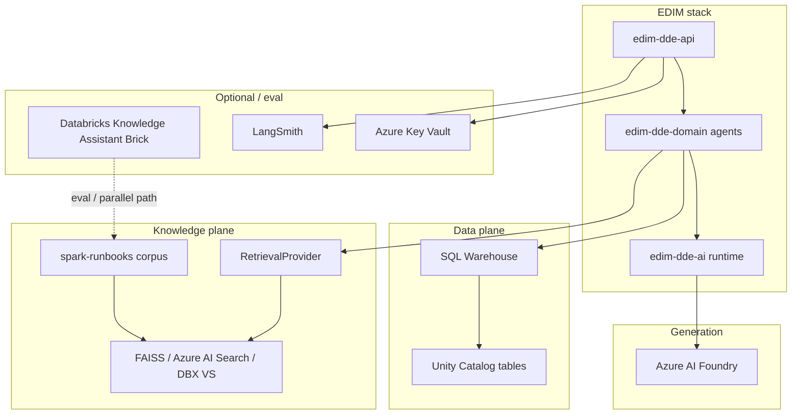
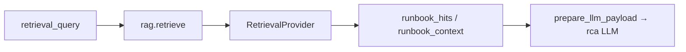

# External add-ons & dependencies (E3e)

**Learning path:** E3e · [Preface](../README.md)  
**← Previous:** [UC telemetry tables](uc-telemetry-tables.md) · **Next:** [Agent package layout](../build-agents/agent-package-layout.md) →

## Chapter summary

Catalog of planes and products **outside** YAML graph nodes that bundled agents depend on — or that teams may evaluate alongside EDIM (Foundry, retrieval, Knowledge Assistant, LangSmith, Key Vault).

**Outcome:** you can see required vs optional external dependencies per agent.

---

This page catalogs **planes and products outside the YAML graph nodes** that the bundled agents depend on — or that teams may evaluate alongside EDIM (e.g. Databricks Knowledge Assistant).



---

## 1. SQL warehouse + Unity Catalog

| Item | Detail |
|------|--------|
| Named source | `edim_sql_wh` in domain `sources.yaml` |
| Auth | Apps: `X-Forwarded-Access-Token`; local: `az login` / `DefaultAzureCredential` |
| Tables | [UC telemetry tables](uc-telemetry-tables.md) |

Without warehouse access, use `metrics` / `evidence_pack` overrides for dry runs only.

---

## 2. Azure AI Foundry (LLM)

| Item | Detail |
|------|--------|
| Adapter | `edim_dde_domain.llm.foundry.FoundryLLMProvider` |
| Env | `EDIM_FOUNDRY_*` (endpoint, deployment, tenant/client — often from Key Vault on Apps) |
| Used by | `cluster_tuning` sizing + explanation; `spark_rca` synthesize |

Missing config → HTTP **503** `FOUNDRY_LLM_NOT_CONFIGURED`.  
Apps path still depends on IAM (App SP → KV + Foundry grant) — see [Key Vault bootstrap](../platform/key-vault-bootstrap.md).

---

## 3. Knowledge plane (EDIM RAG) — used by RCA

EDIM’s knowledge add-on is **not** a separate chat product. It is the **RetrievalProvider** + corpus registry powering `rag.retrieve` inside `spark_rca`.

| Piece | Location / config |
|-------|-------------------|
| Framework node | `rag.retrieve` (`edim-dde-ai`) |
| Corpus name | `spark-runbooks` |
| Registry | `edim_dde_domain/config/corpora.yaml` |
| Sample docs | `edim_dde_domain/knowledge/spark-runbooks/*.md` |
| Backend switch | `EDIM_RETRIEVAL` = `none` \| `faiss` \| `azure_ai_search` \| `databricks_vector` \| … |
| Agent wiring | `spark_rca.agent.yaml` → `retrieve_runbooks` |



| Behavior | Effect |
|----------|--------|
| Index empty / `EDIM_RETRIEVAL=none` | RCA continues; prompt notes no grounding |
| Hits present | Context + optional citations in RCA output |
| `cluster_tuning` | **Does not** call retrieval in R1 |

Deep design: [Retrieval & RAG](../platform/retrieval-and-rag.md).

### Knowledge ingest API

Curated upsert (Acceptance-gated):

```http
POST /api/v1/knowledge/ingest
```

| Field | Meaning |
|-------|---------|
| `corpus` | Logical corpus (`spark-runbooks`) |
| `doc_id` | Stable document id |
| `text` | Body to index |
| `summary` | Optional; prepended for better retrieval |
| `accepted` | **Must be `true`** or request is rejected |
| `metadata` / `source` | Optional provenance |

Bulk / pipeline indexing stays in platform Jobs — not this endpoint.

---

## 4. Databricks Knowledge Assistant (eval / adjacent)

[Databricks Agent Bricks — Knowledge Assistant](https://docs.databricks.com/aws/en/agents/agent-bricks/knowledge-assistant) is a **managed no-code RAG chatbot** on Databricks. It is **not** wired into `edim-dde-api` today.

| | EDIM knowledge plane | Knowledge Assistant (Brick) |
|--|----------------------|------------------------------|
| Hosting | Inside EDIM graph (`rag.retrieve`) | Databricks-managed Brick UI / API |
| Consumers | `spark_rca` LLM grounding | End-user Q&A chat |
| Corpus | `spark-runbooks` (+ ingest) | Brick-configured sources |
| Relationship | Product RCA path | Optional **evaluation** / parallel ops bot |

Workspace eval notes (separate from this guide): repo root `Databricks_AI_Evaluation_Use_Cases.md` (UC1 knowledge bot). Treat KA as a candidate **add-on** for human Q&A over the same runbook material, not as a replacement for the RCA graph.

---

## 5. Observability & secrets

| Add-on | Role |
|--------|------|
| LangSmith / MLflow / none | `EDIM_OBSERVABILITY` — tags include `agent_id`, `env`, `request_id` |
| Azure Key Vault | Load Foundry (and mapped) secrets at API lifespan — critical on Apps |
| StateStore | Control-plane catalog/session — not UC metrics storage |

---

## 6. Dependency matrix by agent

| Dependency | `cluster_tuning` | `spark_rca` |
|------------|------------------|-------------|
| Job cluster metrics UC | Required (or `metrics` override) | — |
| Spark metrics UC | — | Required (or `evidence_pack`) |
| Spark logs UC | — | Required (or `evidence_pack`) |
| Foundry LLM | Required | Required |
| Retrieval / runbooks | — | Optional but recommended |
| Knowledge ingest API | Authoring only | Feeds corpus used at retrieve |
| Knowledge Assistant Brick | Out of band | Out of band |
| LangSmith | Optional | Optional |
| Key Vault | Apps recommended | Apps recommended |

---

## Summary

- SQL/UC and Foundry are core; retrieval and LangSmith are optional but recommended.
- Knowledge Assistant remains out-of-band relative to the YAML graph.

**Next →** [Agent package layout (F1)](../build-agents/agent-package-layout.md)

← [UC telemetry tables](uc-telemetry-tables.md) · [Preface](../README.md) · [Agent package layout](../build-agents/agent-package-layout.md) →
