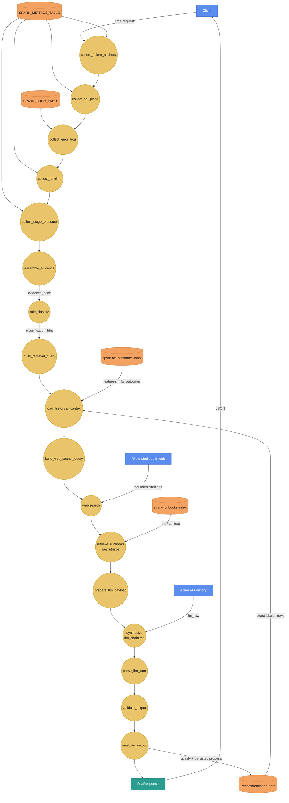
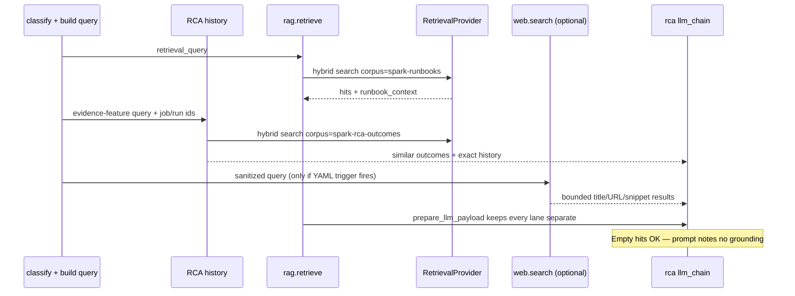

# Spark RCA agent — full walkthrough (E3c)

**Learning path:** E3c · [Guide home](../README.md)  
**← Previous:** [Cluster tuning walkthrough](cluster-tuning-agent.md) · **Next:** [UC telemetry tables](uc-telemetry-tables.md) →

**Agent id:** `spark_rca`  
**Package path:** `edim_dde_domain/agents/spark_rca/`  
**HTTP:** `POST /api/v1/rca/analyze`  
**YAML:** `spark_rca.agent.yaml`

---

## 1. What this agent is for

Ops / DE ask: *“Why did this Spark job run fail, and what should we do next?”*

The agent:

1. Collects **multi-section telemetry** from UC (failure anchors, SQL plans, error logs, timeline, stage pressure) — or accepts an `evidence_pack` override.
2. Assembles a structured **evidence pack** and a YAML-configured broad
   classification hint (the hint is not the diagnosis).
3. Retrieves curated **runbooks**, feature-similar **prior RCA outcomes**, and
   exact same-job/run history.
4. Optionally searches an allowlisted public web provider when YAML enables it
   and the hint is unknown/low-confidence. Only sanitized exception-class tokens
   leave the process.
5. Asks the **RCA LLM** to separate the primary cause, possible causes,
   contributing factors, fixes, and context assessment.
6. Validates the response, attaches deterministic `spark_rca.quality`, and
   persists the diagnosis/actions in the shared recommendation lifecycle store.

It does **not** restart jobs, apply fixes, or open tickets.

---

## 2. Input (HTTP → agent state)

| Field | Required | Meaning |
|-------|----------|---------|
| `job_run_id` | Yes | Primary key for all SQL collectors |
| `job_id` | No | Seeded into evidence / response when known |
| `job_run_date` | No | Partition / date filter for metrics & logs |
| `task_key` | No | Narrow to one task |
| `workspace_id` | No | Reserved / passthrough |
| `error_text` | No | Extra failure text for classify when provided |
| `evidence_pack` | No | Full pack → **skip all SQL** collectors |

### What `evidence_pack` is (and where it comes from)

An **evidence pack** is the structured failure evidence for one run (anchors,
log/SQL excerpts, stage signals, citation `ref`s) — **not** the same as
cluster-tuning `metrics` (SKU / utilization / workers).

| Source | Typical use |
|--------|-------------|
| **Assembled from Databricks UC** | Production: request has `job_run_id` and **no** `evidence_pack` → five SQL collectors run → `assemble_evidence` builds the pack |
| **Sent in the request body** | Dry API / demos: client supplies `evidence_pack` → collectors skip; Foundry + RAG still run |
| **JSON under `testdata/quality/`** | Quality corpus / harness smoke: pack (and often a frozen `output`) comes from case files |

```text
Prod:     { job_run_id }           → live SQL → real evidence_pack → Foundry
Dry API:  { job_run_id, evidence_pack } → skip SQL → Foundry
Harness:  case JSON pack/output    → score fixture  or  invoke + Foundry (SQL usually skipped)
```

Quality harness vs prod: [Evaluation & quality §5b](../framework/evaluation-and-quality.md#5b-where-evidence--metrics-come-from-prod-vs-smoke).

Example (dry):

```bash
curl -s localhost:8080/api/v1/rca/analyze \
  -H 'content-type: application/json' \
  -H 'X-Request-Id: guide-rca-1' \
  -d '{
    "job_run_id": "jr-1",
    "job_id": "j-1",
    "evidence_pack": {
      "job_run_id": "jr-1",
      "evidence": [{"ref": "e1", "excerpt": "Executor OutOfMemoryError: Java heap space"}],
      "raw_anchors": {"failure_reason": "Executor OutOfMemoryError: Java heap space"}
    }
  }'
```

UC attributes: [UC telemetry tables](uc-telemetry-tables.md#spark-metrics-logs).

---

## 3. End-to-end graph (DFD-style)

Circles = processes · orange = UC / index stores · blue = client & Foundry · teal = response.



Each `collect_*` node uses `skip_if_key: evidence_pack` — if the client supplied a pack, SQL is skipped but the rest of the graph still runs.

**YAML RAG policy** (agent header):

```yaml
rag:
  enabled: true
  corpus: spark-runbooks
  top_k: 5
  search_mode: hybrid
  cite: true
```

**YAML web-search policy** (`build_web_search_query.enabled` is the feature flag):

```yaml
- id: build_web_search_query
  type: domain.rca.build_web_search_query
  enabled: false
  trigger: low_confidence_or_unknown
  confidence_below: 0.55
- id: search_public_web
  type: web.search
  enabled: true  # blank query from the disabled policy means no provider call
  top_k: 3
  allowed_domains:
    - docs.databricks.com
    - kb.databricks.com
    - spark.apache.org
    - learn.microsoft.com
```

The host separately configures `EDIM_WEB_SEARCH=none|http_json`. Enabling the flag
without a provider produces an explicit empty context and does not fail RCA.

---

## 4. Step-by-step

### Steps A–E — SQL collectors

| Node id | Table env | `output_key` | What it pulls |
|---------|-----------|--------------|---------------|
| `collect_failure_anchors` | `DATABRICKS_SPARK_METRICS_TABLE` | `failure_anchors` | Failed `pipeline_end` events |
| `collect_sql_plans` | same | `sql_plans` | SQL query observed / error events |
| `collect_error_logs` | `DATABRICKS_SPARK_LOGS_TABLE` | `error_logs` | ERROR/WARNING / exception rows |
| `collect_timeline` | metrics | `timeline_events` | Start/end/job/stage lifecycle |
| `collect_stage_pressure` | metrics | `stage_pressure` | Completed jobs/stages / task summary |

All use source `edim_sql_wh`, `result_mode: rows`, params from `job_run_id` (+ optional date/task).

### Step F — `assemble_evidence`

Merges SQL rows (or override) into a normalized **evidence pack**: excerpts, refs, raw anchors, seeded `job_id` / `job_run_date` when present. Stage pressure ranking prefers failing stages first (parity with legacy collector).

### Step G — `rule_classify`

Produces a broad `classification_hint` from structured SQL-error events and
ordered `signal_groups` in agent YAML. Python implements the generic
pattern-strategy loop; patterns, confidence, rationale, priority, and category
live in YAML. The broad category guides retrieval and is never the final root
cause by itself. Unknown mechanisms remain `unknown` with their exact signature.

### Step H — `build_retrieval_query`

Builds `retrieval_query` text from classify + evidence for similarity / hybrid search.

### Step I — history and optional web enrichment

`load_historical_context` keeps two history lanes separate:

1. `spark-rca-outcomes` — accepted/applied RCA cards retrieved by open
   evidence-feature similarity across jobs.
2. RecommendationStore — exact records for this `job_id` / `job_run_id`,
   including proposed lifecycle rows.

`build_web_search_query` returns an empty query unless YAML enables search and
the trigger fires. It permits only exception/failure class-like tokens; it drops
raw excerpts, SQL, paths, table names, job IDs, run IDs, and arbitrary user text.
`web.search` applies `top_k`, domain allowlisting, provider normalization, and
non-fatal fallback.

### Step J — `retrieve_runbooks` (`rag.retrieve`)

| Config | Value |
|--------|-------|
| Corpus | `spark-runbooks` |
| `top_k` | 5 |
| Mode | `hybrid` |
| Outputs | `runbook_hits`, `runbook_context` |

Backend = process `EDIM_RETRIEVAL` (or corpus override in `corpora.yaml`). Empty index → empty context; RCA LLM still runs with a “no hits” note.

Knowledge design: [Retrieval & RAG](../platform/retrieval-and-rag.md) · [External add-ons](external-addons.md).

### Step K — `prepare_llm_payload`

Flattens evidence, classification, runbooks, prior history, and optional public
web results into distinct prompt sections. The prompt explicitly ranks
current-run evidence above every context lane.

### Step L — `synthesize` (`llm_chain` / chain `rca`)

Foundry completion → `llm_raw`: primary cause, possible causes with verification
steps, contributing factors, grouped fixes, evidence refs, and context assessment.

### Step M — `parse_llm_json`

Parse model JSON into structured fields.

### Step N — `validate_output`

Normalizes categories/shapes, clamps model confidence, drops unknown evidence
refs and unsupplied web URLs, and writes the stable API `result`.

**Evidence citation policy (no silent backfill).** `evidence` reflects the
model's **own** valid citations. We never invent citations to make a response
look complete. If the model cites nothing that resolves to the run's
`evidence_pack` but the pack does have rows, up to three pack rows are attached
as a **labeled preview**: each item carries `backfilled: true` and the result
sets `evidence_backfilled: true`. This keeps the UI populated without implying
the model chose those rows or that they support the summary / recommendations.
The quality evaluator ignores backfilled rows so `evidence` scores reflect
genuine citation behavior (and records `Model did not cite available evidence`).
See [Evaluation & quality](../framework/evaluation-and-quality.md#evidence-citations-vs-backfilled-preview).

### Step O — `evaluate_output`

Runs `spark_rca.quality`. Its confidence is deterministic evidence-pack
completeness plus rubric coverage; it is not the model's probability. The API
persists the final diagnosis/actions as lifecycle status `proposed`. Stored
rows keep a **bounded** `evidence_pack` snapshot (anchors + truncated excerpts)
and omit regenerated prompt context (`runbook_context`, `historical_context`,
web hits) so Cosmos/Redis payloads stay small while experience indexing still
has feature material.

---

## 5. Output (`RcaResponse`)

| Field | Meaning |
|-------|---------|
| `root_cause` | category, summary, model confidence, signature |
| `quality` | deterministic score, evaluator confidence, dimensions, findings |
| `possible_causes` | bounded alternatives + evidence refs + verification checks |
| `recommended_actions` | Flat action list |
| `recommendations` | Structured buckets (infra / code / …) when present |
| `contributing_factors` | Secondary factors |
| `evidence_analysis` | How evidence was weighed |
| `evidence` | Model-cited snippets / refs. Each item has `backfilled` (true only for labeled pack preview when the model cited nothing) |
| `evidence_backfilled` | `true` when `evidence` holds pack-preview rows the model did not cite (never a silent citation) |
| `timeline` | Normalized timeline |
| `classification_hint` | Rule-based hint |
| `context_assessment` | How runbooks/history/web corroborated or conflicted |
| `runbook_context` / `historical_context` | Grounding supplied to the LLM |
| `web_search_hits` | Bounded title/URL/snippet results (when enabled) |
| `job_status` / `status` | Job / agent status |
| `evidence_pack` | Pack used (when projected) |
| `request_id` | Correlation |
| `recommendation_id` / `recommendation_status` | Persisted lifecycle record |

Missing `result` after invoke → HTTP 500 (no silent full-state dump).

---

??? note "In depth (optional) — engineers — evidence, extensibility, history, web, and confidence"

    Read this when you are dry-testing RCA, adding failure categories, or deciding
    whether a new signal belongs in classify vs runbooks.

    **Live SQL vs `evidence_pack`.** With no override, Steps A–E each run a SQL
    collector against the Spark metrics/logs UC tables; Step F assembles the pack.
    When the request includes `evidence_pack`, **all five collectors are skipped**
    and the supplied pack is used as-is (same shape the API projector later
    returns). Use that for CI, Windows smoke, and demos without warehouse access.
    The classify / RAG / LLM path is unchanged either way.

    **Where policy and signals live.**

    | Layer | Owns | Extend by |
    |-------|------|-----------|
    | `spark_rca.agent.yaml` `signal_groups` | Ordered broad-category hint patterns, confidence, rationale | Add/edit YAML; no classifier Python change |
    | `helpers/classify.py` | Generic ordered pattern strategy + structured SQL-error handling | Change only when the classification mechanism changes |
    | `knowledge/spark-runbooks/` | Human playbooks retrieved into `runbook_context` | New markdown + re-index; no Python |
    | `helpers/experience_transform.py` | Open evidence features → diagnosis/action card | Extend generic feature extraction, not named scenarios |
    | RCA skills / prompts | How the LLM weighs evidence + citations | Content under `agents/spark_rca/content/` |
    | `validate_output` | Structural clamps on the LLM JSON | Only when the response schema grows |

    **OOM / memory as an example, not a peer of cluster-tuning pressure.** RCA
    may treat OOM language as **failure evidence** because the job failed and
    logs/anchors say so. That is the opposite of cluster-tuning, which must not
    invent OOM from high utilization alone. Keep the taxonomies separate: RCA =
    why it failed; tuning = how to right-size from metrics.

    **Adding a category without a new node type.** Prefer: (1) a YAML signal group +
    broad category, (2) a runbook page whose keywords match the retrieval query, (3)
    skill text that tells the LLM how to cite that runbook. Only introduce a new
    `domain.rca.*` node when the graph topology itself must change (extra collect,
    new validation gate, etc.).

    Empty retrieval is intentional: the LLM still runs with an explicit “no
    runbook hits” note so synthesis never silently pretends grounding existed.

    **History acceptance gate.** Every successful analysis is persisted as
    `proposed`, so exact job/run history is immediately available. Cross-job
    experience similarity indexes only `accepted` or `applied` RCA records.
    `rejected` and `superseded` remove indexed cards. This prevents an unreviewed
    model diagnosis from becoming precedent.

    **Two confidence values.** `root_cause.confidence` /
    `root_cause.model_confidence` is the model/rule estimate. `quality.confidence`
    measures evidence-pack completeness plus deterministic rubric coverage.
    Product gates should use `quality.passed`, dimensions, and findings rather
    than treating model confidence as calibrated probability.

    **Web-search boundary.** YAML is the per-agent feature flag; environment
    configuration selects a provider. Search is low-confidence/unknown-only by
    default, domains are allowlisted, queries contain only technical
    exception-class tokens, and provider failure is non-fatal. Web snippets are
    untrusted data and can never replace an `evidence_pack` ref.

---

## 6. Knowledge path (detail)



**Curated ingest** (Acceptance-gated): `POST /api/v1/knowledge/ingest` with `accepted: true` — see [External add-ons](external-addons.md#knowledge-ingest-api). Bulk indexing remains Jobs / platform.

---

## 7. External dependencies (this agent)

| Dependency | Role |
|------------|------|
| Spark metrics UC table | Anchors, plans, timeline, stages |
| Spark logs UC table | Error / warning / exception text |
| Foundry LLM | RCA synthesis |
| RetrievalProvider + corpus | Runbook grounding |
| RecommendationStore | RCA lifecycle + exact history |
| `spark-rca-outcomes` corpus | Accepted/applied feature-similar diagnoses/actions |
| WebSearchProvider (optional) | Allowlisted public-web enrichment |
| Sample markdown | `knowledge/spark-runbooks/` for local FAISS seed |
| LangSmith (optional) | Traces |

---

## 8. Source map

| Concern | Location |
|---------|----------|
| Graph | `agents/spark_rca/spark_rca.agent.yaml` |
| Nodes | `agents/spark_rca/nodes.py` + logic helpers |
| Evidence / classify / validate | `helpers/` |
| Experience/history | `helpers/experience_transform.py`, `helpers/historical_context.py` |
| Quality evaluator | `evaluation/spark_rca.py` |
| Corpus registry | `config/corpora.yaml` |
| Sample runbooks | `knowledge/spark-runbooks/` |
| Prompts / skills | `content/prompts/`, `content/skills/` |

Lifecycle API:

- `GET /api/v1/rca/recommendations`
- `GET /api/v1/rca/recommendations/{recommendation_id}`
- `PATCH /api/v1/rca/recommendations/{recommendation_id}`

---

← [Cluster tuning walkthrough](cluster-tuning-agent.md) · [Guide home](../README.md) · [UC telemetry tables](uc-telemetry-tables.md) →
