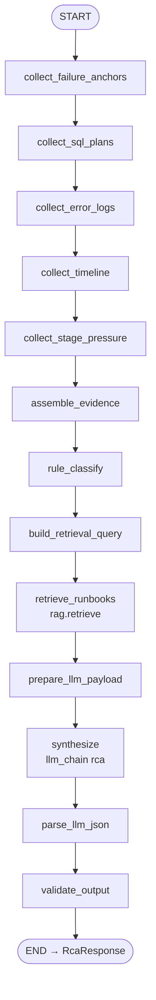
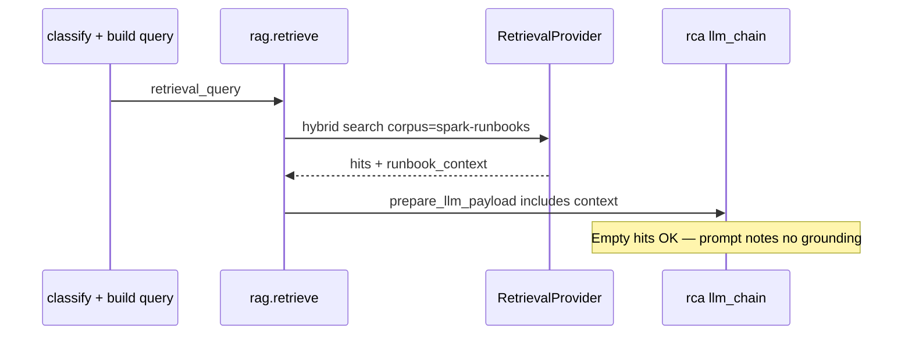

# Spark RCA agent — full walkthrough (E3c)

**Learning path:** E3c · [Guide home](../README.md)  
**← Previous:** [Cluster tuning walkthrough](cluster-tuning-agent.md) · **Next:** [UC telemetry tables](uc-telemetry-tables.md) →

**Agent id:** `spark_rca`  
**Package path:** `edim_dde_domain/agents/spark_rca/`  
**HTTP:** `POST /api/v1/rca/analyze`  
**YAML:** `spark_rca.agent.yaml`

---

## 1. What this agent is for

Ops / DE ask: *“Why did this Spark job run fail, and what should we do next?”*

The agent:

1. Collects **multi-section telemetry** from UC (failure anchors, SQL plans, error logs, timeline, stage pressure) — or accepts an `evidence_pack` override.
2. Assembles a structured **evidence pack** and a **rule-based classification hint**.
3. Builds a retrieval query and calls **`rag.retrieve`** against the `spark-runbooks` corpus (knowledge plane).
4. Asks the **RCA LLM** to synthesize root cause, actions, and structured recommendations with citations when hits exist.
5. Parses + validates output into a stable **`RcaResponse`**.

It does **not** restart jobs or open tickets (integrations are later backlog).

---

## 2. Input (HTTP → agent state)

| Field | Required | Meaning |
|-------|----------|---------|
| `job_run_id` | Yes | Primary key for all SQL collectors |
| `job_id` | No | Seeded into evidence / response when known |
| `job_run_date` | No | Partition / date filter for metrics & logs |
| `task_key` | No | Narrow to one task |
| `workspace_id` | No | Reserved / passthrough |
| `error_text` | No | Extra failure text for classify when provided |
| `evidence_pack` | No | Full pack → **skip all SQL** collectors |

Example (dry):

```bash
curl -s localhost:8080/api/v1/rca/analyze \
  -H 'content-type: application/json' \
  -H 'X-Request-Id: guide-rca-1' \
  -d '{
    "job_run_id": "jr-1",
    "job_id": "j-1",
    "evidence_pack": {
      "job_run_id": "jr-1",
      "evidence": [{"ref": "e1", "excerpt": "Executor OutOfMemoryError: Java heap space"}],
      "raw_anchors": {"failure_reason": "Executor OutOfMemoryError: Java heap space"}
    }
  }'
```

UC attributes: [UC telemetry tables](uc-telemetry-tables.md#spark-metrics-logs).

---

## 3. End-to-end graph (all nodes)



Each `collect_*` node uses `skip_if_key: evidence_pack` — if the client supplied a pack, SQL is skipped but the rest of the graph still runs.

**YAML RAG policy** (agent header):

```yaml
rag:
  enabled: true
  corpus: spark-runbooks
  top_k: 5
  search_mode: hybrid
  cite: true
```

---

## 4. Step-by-step

### Steps A–E — SQL collectors

| Node id | Table env | `output_key` | What it pulls |
|---------|-----------|--------------|---------------|
| `collect_failure_anchors` | `DATABRICKS_SPARK_METRICS_TABLE` | `failure_anchors` | Failed `pipeline_end` events |
| `collect_sql_plans` | same | `sql_plans` | SQL query observed / error events |
| `collect_error_logs` | `DATABRICKS_SPARK_LOGS_TABLE` | `error_logs` | ERROR/WARNING / exception rows |
| `collect_timeline` | metrics | `timeline_events` | Start/end/job/stage lifecycle |
| `collect_stage_pressure` | metrics | `stage_pressure` | Completed jobs/stages / task summary |

All use source `edim_sql_wh`, `result_mode: rows`, params from `job_run_id` (+ optional date/task).

### Step F — `assemble_evidence`

Merges SQL rows (or override) into a normalized **evidence pack**: excerpts, refs, raw anchors, seeded `job_id` / `job_run_date` when present. Stage pressure ranking prefers failing stages first (parity with legacy collector).

### Step G — `rule_classify`

Deterministic taxonomy hint (`classification_hint`) from failure text / anchors (OOM, SQL error, timeout, …). Guides retrieval + LLM; not the final root cause alone.

### Step H — `build_retrieval_query`

Builds `retrieval_query` text from classify + evidence for similarity / hybrid search.

### Step I — `retrieve_runbooks` (`rag.retrieve`)

| Config | Value |
|--------|-------|
| Corpus | `spark-runbooks` |
| `top_k` | 5 |
| Mode | `hybrid` |
| Outputs | `runbook_hits`, `runbook_context` |

Backend = process `EDIM_RETRIEVAL` (or corpus override in `corpora.yaml`). Empty index → empty context; RCA LLM still runs with a “no hits” note.

Knowledge design: [Retrieval & RAG](../platform/retrieval-and-rag.md) · [External add-ons](external-addons.md).

### Step J — `prepare_llm_payload`

Flattens evidence + classification + **runbook_context** into prompt string fields for the RCA human template.

### Step K — `synthesize` (`llm_chain` / chain `rca`)

Foundry completion → `llm_raw` (JSON-shaped RCA answer + skills).

### Step L — `parse_llm_json`

Parse model JSON into structured fields.

### Step M — `validate_output`

Legacy-aligned validate: confidence clamp, required shapes, rich recommendation blocks. Writes final `result` object required by the API projector.

---

## 5. Output (`RcaResponse`)

| Field | Meaning |
|-------|---------|
| `root_cause` | category, summary, confidence, optional signature |
| `recommended_actions` | Flat action list |
| `recommendations` | Structured buckets (infra / code / …) when present |
| `contributing_factors` | Secondary factors |
| `evidence_analysis` | How evidence was weighed |
| `evidence` | Cited snippets / refs |
| `timeline` | Normalized timeline |
| `classification_hint` | Rule-based hint |
| `job_status` / `status` | Job / agent status |
| `evidence_pack` | Pack used (when projected) |
| `request_id` | Correlation |

Missing `result` after invoke → HTTP 500 (no silent full-state dump).

---

## 6. Knowledge path (detail)



**Curated ingest** (Acceptance-gated): `POST /api/v1/knowledge/ingest` with `accepted: true` — see [External add-ons](external-addons.md#knowledge-ingest-api). Bulk indexing remains Jobs / platform.

---

## 7. External dependencies (this agent)

| Dependency | Role |
|------------|------|
| Spark metrics UC table | Anchors, plans, timeline, stages |
| Spark logs UC table | Error / warning / exception text |
| Foundry LLM | RCA synthesis |
| RetrievalProvider + corpus | Runbook grounding |
| Sample markdown | `knowledge/spark-runbooks/` for local FAISS seed |
| LangSmith (optional) | Traces |

---

## 8. Source map

| Concern | Location |
|---------|----------|
| Graph | `agents/spark_rca/spark_rca.agent.yaml` |
| Nodes | `agents/spark_rca/nodes.py` + logic helpers |
| Evidence / classify / validate | `helpers/` |
| Corpus registry | `config/corpora.yaml` |
| Sample runbooks | `knowledge/spark-runbooks/` |
| Prompts / skills | `content/prompts/`, `content/skills/` |

---

← [Cluster tuning walkthrough](cluster-tuning-agent.md) · [Guide home](../README.md) · [UC telemetry tables](uc-telemetry-tables.md) →
