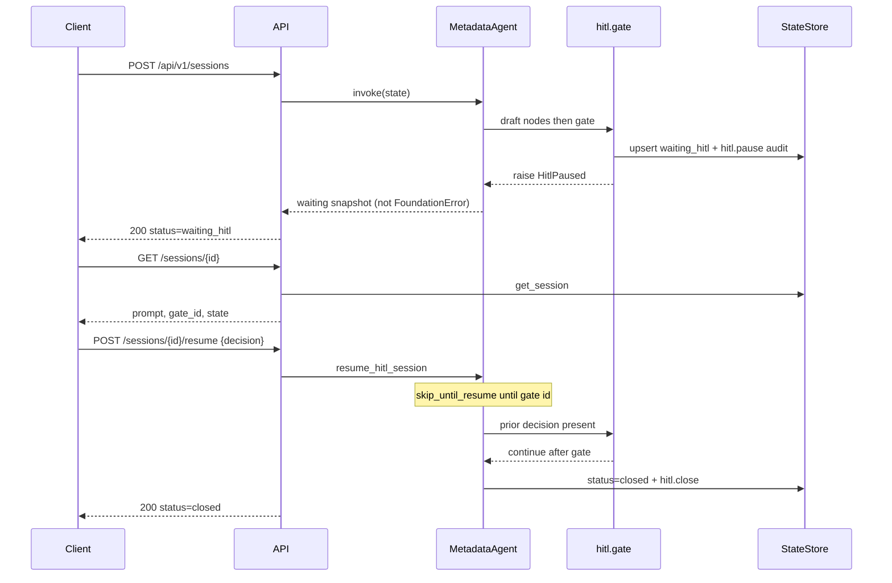

# HITL interrupt / resume (D6b)

**Learning path:** D6b · [Guide home](../README.md)  
**← Previous:** [Orchestration](orchestration-topology.md) · **Next:** [Evaluation & quality](evaluation-and-quality.md) →

Human-in-the-loop: pause a graph at a gate, persist a **StateStore session**, then continue after approve / reject / modify.

**R1 scope:** in-process only (same App). Not LangGraph checkpointers, not risk-based escalation (BL-039 later), not a UI.

This page is the **user guide** (YAML + HTTP) and the **engineer guide** (patterns, skip Decorator, why `HitlPaused` is not an error). Product graphs (`cluster_tuning`, `spark_rca`) do **not** pause unless you add a `hitl.gate`.

---

## 1. Flow

```text
POST /api/v1/sessions  { agent_id, state }
        │
        ▼
agent.invoke(state)
  nodes before the gate run
  hitl.gate  →  persist SessionRecord status=waiting_hitl
             →  stop (HitlPaused — not an error)
        │
        ▼
HTTP 200  status=waiting_hitl  session_id=…

Human reviews GET /api/v1/sessions/{id}

POST /api/v1/sessions/{id}/resume  { decision, comment?, patch? }
        │
        ▼
resume_hitl_session()
  merge hitl_decisions[gate_id]
  re-invoke with hitl_resume_at=gate_id
  nodes *before* the gate are skipped
  gate sees the decision → continue
  remaining nodes run
        │
        ▼
HTTP 200  status=closed   (or waiting_hitl if another gate fires)
```



`correlation_id` is the HTTP `X-Request-Id` (also stored on the session when the start payload includes `request_id`). Do **not** copy LangSmith `request_id` into every agent state’s data bag; observability merge stays on invoke kwargs.

---

## 2. YAML

Two layers (unchanged names, now enforced):

| Field | Layer | Meaning |
|-------|--------|---------|
| `metadata.hitl_required` | Catalog | Synced to `AgentRecord` — “this agent should involve a human” |
| `hitl.enabled` | Runtime | If **false**, `hitl.gate` is a no-op (unless state `hitl_enabled` is true) |
| `hitl.gate` node | Graph | Actual pause point |

```yaml
hitl:
  enabled: true
metadata:
  hitl_required: true
graph:
  nodes:
    - id: draft
      type: set_value
      field: proposal
      template: "resize-{name}"
    - id: approve
      type: hitl.gate
      prompt: Approve the proposed action?
    - id: finish
      type: set_value
      field: status
      template: "done:{hitl_decision}"
  edges:
    - [START, draft]
    - [draft, approve]
    - [approve, finish]
    - [finish, END]
```

Put the gate **after** expensive SQL/LLM work you do not want to re-run. On resume, nodes **before** the gate are skipped (`hitl_resume_at`). Nodes after the gate run with `hitl_decision` in state (`approved` \| `rejected` \| `modified`).

Optional state flags:

| Key | Effect |
|-----|--------|
| `skip_hitl` | Gate is a no-op (automation / tests) |
| `hitl_enabled` | Force gate on even if YAML `hitl.enabled` is false |

Branch after the gate with existing routers if reject should not continue the happy path:

```yaml
conditional_edges:
  - source: approve
    router: field_equals
    config: { field: hitl_decision, value: approved }
    mapping: { yes: apply, no: rejected_end }
```

Shipped demo: `hitl_demo` in `edim-dde-domain` (also `edim-dde-ai/examples/agents/hitl_demo.agent.yaml`).

---

## 3. HTTP

| Method | Path | Purpose |
|--------|------|---------|
| POST | `/api/v1/sessions` | Start invoke; may return `waiting_hitl` |
| GET | `/api/v1/sessions/{session_id}` | Load persisted snapshot |
| POST | `/api/v1/sessions/{session_id}/resume` | Apply decision and continue |

Resume body:

```json
{
  "decision": "approved",
  "comment": "ok",
  "patch": {},
  "actor": "analyst@example.com"
}
```

| HTTP | When |
|------|------|
| 200 | Start or resume succeeded |
| 404 | Unknown agent or session |
| 400 | Invalid decision |
| 409 | Session is not `waiting_hitl` (already closed / resumed) |

Product routes (`/rca/analyze`, `/cluster_tuning/recommend`) are **unchanged** — they do not pause unless you add a `hitl.gate` to those graphs.

---

## 4. Persistence

Uses the process **StateStore** (default `memory`; Postgres/Cosmos/Redis via `EDIM_STATE_STORE`).

| Field | Value |
|-------|--------|
| `session_id` | UUID from the gate (or caller-supplied `state.session_id`) |
| `status` | `waiting_hitl` → `closed` |
| `state` | Flat agent snapshot |
| `extra.gate_id` / `prompt` | Reviewer UX |
| Audit | `hitl.pause` · `hitl.resume` · `hitl.close` |

Laptop: memory store is enough for a demo; use Postgres if you need sessions to survive process restart.

---

## 5. Programmatic API

```python
from edim_dde_ai import create_agent, resume_hitl_session

out = create_agent("hitl_demo").invoke({"name": "job-1"})
# out["hitl_status"] == "waiting_hitl"

final = resume_hitl_session(
    out["session_id"],
    decision="approved",
    comment="ship it",
)
```

Prefer `resume_hitl_session` over re-implementing merge + invoke in a product route. The API’s `/sessions/{id}/resume` is a thin wrapper around that Facade.

---

## 6. Design patterns (GoF)

HITL reuses the same small pattern set as the rest of the framework ([end-to-end design §4](../architecture/end-to-end-design.md)). Do not add a second skip helper in a domain node.

| Pattern | Where | Role |
|---------|-------|------|
| **Registry + Factory Method** | `hitl.gate` in `BUILTIN_NODE_FACTORIES` | YAML `type: hitl.gate` → factory |
| **Builder** | `GraphBuilder.add_nodes` | Injects `node_id` / `hitl.enabled`; wraps every node |
| **Decorator** | `skip_until_resume` | Returns `{}` for nodes before `hitl_resume_at` |
| **Adapter** | `adapt_node` | Applied **after** the skip Decorator (flat state first) |
| **Template Method** | `MetadataAgent.invoke` / `ainvoke` | Shared prepare / extract / kwargs merge / pause unwrap |
| **Facade** | `resume_hitl_session` | Merge decision, re-invoke, close session |
| **Strategy** | `StateStore` backends | Memory vs Postgres vs Cosmos vs Redis for the same session API |
| **State** | `waiting_hitl` → `closed` | Session lifecycle; decisions keyed by gate id |

Wrap order (must stay this order):

```text
factory(config) → skip_until_resume(node_id, fn) → adapt_node(fn)
```

If you wrap after `adapt_node`, the Decorator would see `{"data": {...}}` and would not find `hitl_resume_at`.

---

## 7. Session state machine

```text
            POST /sessions
                  │
                  ▼
           graph runs to gate
                  │
                  ▼
            waiting_hitl  ──GET /sessions/{id}──► reviewer
                  │
                  │  POST /resume  decision ∈ {approved, rejected, modified}
                  ▼
              resuming     (in-graph; hitl_decisions[gate_id] set)
                  │
         ┌────────┴────────┐
         ▼                 ▼
      closed          waiting_hitl
   (graph finished)  (another gate fired)
```

| Status | Who writes it | Meaning |
|--------|---------------|---------|
| `waiting_hitl` | `hitl.gate` via `persist_hitl_pause` | Human decision required |
| `resuming` | `merge_hitl_decision` | Input to the resume invoke |
| `resumed` | gate, when a prior decision exists | Gate passed; later nodes may run |
| `closed` | `close_hitl_session` after a non-pause finish | Terminal for this session id |

HTTP maps in-graph `resumed` to `closed` on the response. `GET` returns the persisted `SessionRecord.status` (`waiting_hitl` or `closed`).

Invalid resume (unknown id, not waiting, unknown decision) is `HitlError` → HTTP 400 / 409. That **is** a failure. Pause is not.

---

## 8. Why `HitlPaused` is not an error

`HitlPaused` does **not** subclass `FoundationError`. It is control flow: the graph stopped on purpose.

| Type | Superclass | When |
|------|------------|------|
| `HitlPaused` | `Exception` | Gate persisted a session and stopped later nodes |
| `HitlError` | `FoundationError` | Bad session / status / decision |

`MetadataAgent` catches `HitlPaused` and returns `paused.state` (the waiting snapshot). Callers and HTTP handlers treat that as success with `status=waiting_hitl`. If it were a `FoundationError`, observability and API error mapping would treat a normal approval pause as a crash.

Do not `raise HitlError` from the gate for a pause. Do not swallow `HitlPaused` inside a domain node.

---

## 9. Package layout (reuse)

```
edim_dde_ai/hitl/
  decorator.py   skip_until_resume + RESUME_AT_KEY
  gate.py        hitl_gate_factory + apply_gate_build_config
  sessions.py    persist / merge / resume / close + status constants
  __init__.py    Facade re-exports
```

`nodes/builtin.py` only **registers** `"hitl.gate": hitl_gate_factory`. Graph skip logic lives in `hitl/decorator.py`, not in `graph/builder.py`. Session merge lives in `merge_hitl_decision` / `prior_decision_for_gate` so the gate and resume path cannot drift.

---

## 10. Out of scope (later)

- LangGraph checkpointer / `interrupt()` native tree
- Risk-based reviewers, timeouts, escalation (BL-039)
- UI approval inbox
- Cross-app HITL (needs control plane — parked)
- Wiring `hitl.gate` into `cluster_tuning` / `spark_rca` product graphs

---

??? note "In depth (optional) — engineers — skip Decorator, decision merge, and wrap order"

    **Skip without a checkpointer.** R1 does not persist LangGraph checkpoints. Resume re-invokes the same compiled graph with `hitl_resume_at=<gate_id>`. `skip_until_resume` is a Decorator around the *flat* node: if that key is set and is not this node id, return `{}` (empty update; Adapter still wraps it). When the key matches the gate id, the gate runs, sees `hitl_decisions[gate_id]`, clears `hitl_resume_at`, and later nodes run normally.

    **Why every node is wrapped.** Only wrapping the gate would still re-run `draft` / SQL / LLM on resume. Wrapping all nodes is O(1) per node at build time and keeps product YAML free of skip flags.

    **Decision shape.** `merge_hitl_decision` writes:

    ```python
    state["hitl_decisions"][gate_id] = {
        "decision": "approved" | "rejected" | "modified",
        "comment": "...",
        "patch": {...},
        "actor": "...",
    }
    ```

    plus convenience keys `hitl_decision`, `hitl_comment`, `session_id`, and optional `patch` merged into the flat bag. The gate uses `prior_decision_for_gate` so pause and resume share one lookup.

    **`modified`.** `patch` is extra state keys (for example an edited recommendation). The graph after the gate must read those keys; the framework does not deep-merge nested dicts.

    **Multiple gates.** A later `hitl.gate` can pause again. The same session id is reused if `state.session_id` is still set; status returns to `waiting_hitl`. Nodes before *that* gate are skipped on the next resume.

    **Observability.** `MetadataAgent._merge_kwargs` attaches trace tags on invoke kwargs only. Copying `request_id` from LangSmith into the data bag leaks into every agent’s state and breaks tests that assert exact keys.

    **API mapping.** `POST /sessions` and `/resume` project invoke state via `_session_response`. `GET` projects the `SessionRecord` via `_session_response_from_record` (prompt/gate_id prefer `extra`). HTTP `resumed` → `closed`.

    **Tests.** `edim-dde-ai/tests/test_hitl.py` covers pause, skip-before-gate, reject, invalid decision, disabled YAML, and the Decorator/merge helpers. API coverage is `test_hitl_session_pause_get_resume` in `edim-dde-api/tests/test_agents_e2e.py`.

---

## Related

| Doc | Topic |
|-----|--------|
| [Orchestration](orchestration-topology.md) | In-process `invoke_agent` |
| [Nodes and routers](nodes-and-routers.md) | Factory → Decorator → Adapter wrap order |
| [End-to-end design §4](../architecture/end-to-end-design.md) | GoF map (Decorator, State, Facade) |
| [State store](../platform/state-store.md) | Session backend |
| [YAML schema](yaml-schema.md) | `hitl.enabled` vs `metadata.hitl_required` |
| [HTTP endpoints](../api/endpoints.md) | Session routes |

<!-- edim-learning-nav -->
---

← [Orchestration](orchestration-topology.md) · [Guide home](../README.md) · [Evaluation & quality](evaluation-and-quality.md) →
