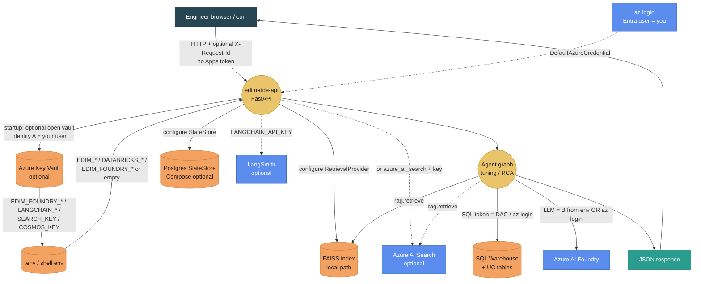
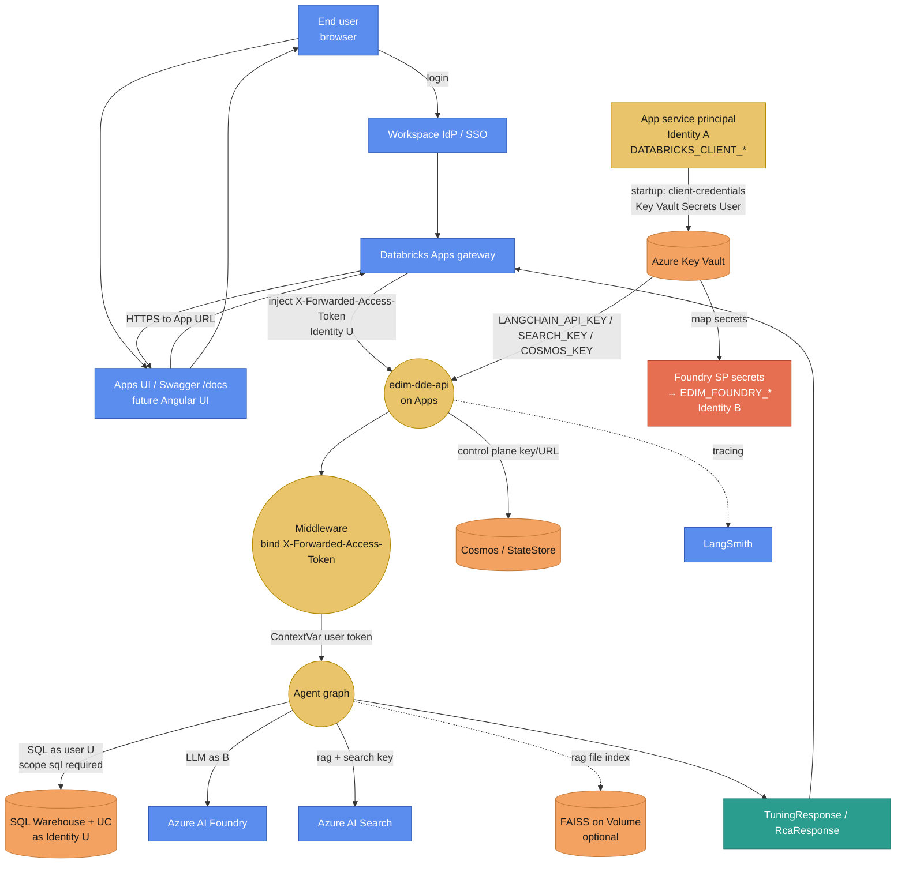
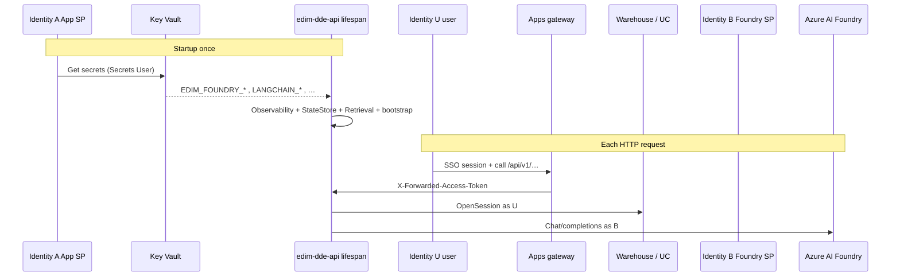
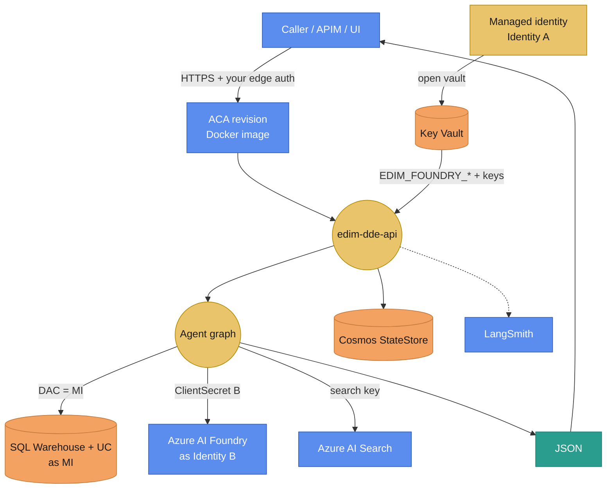

# Authentication flows (local vs Apps / prod)

**Learning path:** C2b-flow · [Preface](../README.md)  
**← Previous:** [Access & permissions](access-and-permissions.md) · **Next:** [Key Vault bootstrap](key-vault-bootstrap.md) →

## Chapter summary

Visual end-to-end authentication: who authenticates to what, from the user request through FastAPI to UC, RAG/Search, Foundry, stores, LangSmith, and Key Vault — for local, Apps, and prod-shaped hosts.

**Outcome:** you can explain each hop’s principal without conflating SQL, Foundry, and KV identities.

---

Visual end-to-end auth: **who authenticates to what**, from the user’s request through FastAPI to UC, RAG / Azure AI Search, Foundry, state stores, LangSmith, and Key Vault.

**Companion pages:** identities U / A / B → [Access & permissions](access-and-permissions.md) · token code paths → [Auth and SQL](../architecture/auth-and-sql.md) · KV details → [Key Vault bootstrap](key-vault-bootstrap.md).

---

## 0. Legend

| Shape / color | Meaning |
|---------------|---------|
| **Blue box** | External actor or SaaS / cloud product |
| **Gold circle** | Process step inside EDIM (API / agent) |
| **Orange cylinder / box** | Data store or secret store |
| **Teal box** | HTTP response / DTO back to client |
| **Identity U** | Signed-in **user** (SQL on Apps) |
| **Identity A** | **Host runtime** (opens Key Vault / platform Azure) |
| **Identity B** | **Foundry workload SP** (`EDIM_FOUNDRY_*`) |

**Timing**

| When | What authenticates |
|------|-------------------|
| **Startup (lifespan)** | Key Vault → env; observability; StateStore; RetrievalProvider; agent bootstrap |
| **Per request** | Apps user token bind; SQL warehouse; LLM; RAG query; optional StateStore session writes |

There is **no separate Angular UI in R1**. “Databricks UI / App” = Apps shell + **Swagger** (`/docs`) or a future UI. The Apps **gateway** injects `X-Forwarded-Access-Token`; the browser does not set it manually.

---

## 1. Service catalog — how each dependency is authenticated

| Service / plane | What EDIM calls it for | Auth mechanism | Typical secret / identity |
|-----------------|------------------------|----------------|---------------------------|
| **Databricks Apps gateway** | Terminate user SSO; forward token | Workspace IdP / Apps session | Identity **U** token in `X-Forwarded-Access-Token` |
| **edim-dde-api (FastAPI)** | Routes + middleware | Process identity = host | Identity **A** on the VM/container/App |
| **SQL Warehouse → UC tables** | Metrics / Spark telemetry | Apps: user OAuth; else `DefaultAzureCredential` | **U** (Apps) or **A**/you (local/ACA) |
| **Azure Key Vault** | Load Foundry / LangSmith / Search / Cosmos keys at startup | Apps SP / MI / `az login` / `EDIM_KV_CLIENT_*` | Identity **A** (or dedicated KV reader) |
| **Azure AI Foundry** | `llm_chain` (sizing, RCA, explanation) | `ClientSecretCredential` if `EDIM_FOUNDRY_*`; else DAC | Identity **B** (or your user locally) |
| **Retrieval — FAISS** | Local / Volume index | Filesystem path only | No cloud auth |
| **Retrieval — Azure AI Search** | Hybrid / vector RAG | API key (or later AAD) | `EDIM_AZURE_SEARCH_KEY` (often from KV) |
| **Retrieval — Databricks Vector Search** | Optional corpus override | Workspace / SP patterns per provider | Config in `corpora.yaml` + host creds |
| **StateStore — memory** | Dev catalog | In-process | None |
| **StateStore — Postgres** | Local Compose / control plane | Connection string / password | `EDIM_POSTGRES_*` (Compose defaults) |
| **StateStore — Cosmos** | Deployed control plane | Account key (or AAD later) | `EDIM_COSMOS_KEY` (KV) |
| **StateStore — Redis** | Optional | Connection URL / password | Env |
| **LangSmith** | Traces / tags | API key header | `LANGCHAIN_API_KEY` (KV or `.env`) |
| **MLflow** (if selected) | Traces | Tracking URI + host auth | `EDIM_OBSERVABILITY=mlflow` env |

**Do not** put Foundry SP into `AZURE_CLIENT_*` — that hijacks SQL’s `DefaultAzureCredential`.

---

## 2. Local laptop (engineer / dry–live with `az login`)

Typical: `uvicorn` or Docker Compose on your machine. No Apps gateway. SQL and (often) Foundry use **your** Entra user after `az login`.

### Local — per hop

| Hop | Credential |
|-----|------------|
| You → API | None (localhost); optional `X-Request-Id` only |
| API → Key Vault | Optional; `DefaultAzureCredential` = your `az login` (or skip KV, put secrets in `.env`) |
| API → Postgres | Compose user/password (`edim`/`edim`) or env URL |
| API → FAISS | Path `EDIM_FAISS_INDEX_PATH` — no token |
| API → Azure AI Search | `EDIM_AZURE_SEARCH_KEY` if `EDIM_RETRIEVAL=azure_ai_search` |
| Agent → SQL / UC | `DefaultAzureCredential` (your user) — must have warehouse + UC SELECT |
| Agent → Foundry | Prefer `EDIM_FOUNDRY_*` SP; if unset, `az login` as you |
| API → LangSmith | `LANGCHAIN_API_KEY` if tracing on |

**Apps token middleware:** inactive / no `X-Forwarded-Access-Token` — SQL never uses a forwarded user token locally.

---

## 3. Databricks Apps (DEV / PROD-style) — SP + KV + user SQL

This is the **primary hosted path** today (`edim-dde-api-dev`). User signs into the workspace; Apps UI / Swagger calls the App URL.

### Apps — startup vs request

### Apps — per hop

| Hop | Identity | Detail |
|-----|----------|--------|
| User → IdP → Apps | User SSO | Workspace login |
| Gateway → API | Forwards **U** | `X-Forwarded-Access-Token`; App needs user auth scope **`sql`** |
| API → Key Vault | **A** App SP | `DATABRICKS_CLIENT_ID` / `SECRET` + `AZURE_TENANT_ID` |
| KV → process env | — | `EDIM_KV_SECRET_MAP` → `EDIM_FOUNDRY_*`, keys, etc. |
| Agent → SQL / UC | **U** | User must CAN USE warehouse + SELECT on tables |
| Agent → Foundry | **B** | Foundry/OpenAI data-plane role on SP |
| Agent → Azure AI Search | Key | `EDIM_AZURE_SEARCH_KEY` from KV or Apps secrets |
| Agent → FAISS Volume | Path | Workspace/Volume ACLs for App runtime |
| API → Cosmos / Redis | Key / URL | From KV or Apps env |
| API → LangSmith | API key | `LANGCHAIN_API_KEY` |

**IAM still often missing in DEV:** A → KV Secrets User, and B → Foundry access (P0 parked).

---

## 4. Azure Container Apps (prod alternative) — MI + KV

No Apps user token. SQL runs as the **container managed identity** (Identity **A**). Callers authenticate however you put in front (APIM / Easy Auth / private network) — not shown as Identity U unless you add it later (BL-056).

Grant MI on warehouse + UC: [Deploy §6.4](../api/deploy-and-hosting.md#64-aca-sql-grant-managed-identity-warehouse-uc).

---

## 5. Side-by-side matrix (local vs Apps vs ACA)

| Dependency | Local | Databricks Apps | ACA |
|------------|-------|-----------------|-----|
| **Entry auth** | Trust localhost / VPN | Workspace SSO + Apps gateway | Edge / network (your design) |
| **SQL / UC** | Your `az login` | **User U** forwarded token | **MI A** |
| **Key Vault opener** | You or skip | **App SP A** | **MI A** |
| **Foundry** | You or **B** in `.env` | **B** from KV | **B** from KV |
| **Azure AI Search** | Key in `.env` | Key from KV / Apps secrets | Key from KV |
| **FAISS** | Local disk | Volume path | Disk / mount |
| **Postgres StateStore** | Compose | Rare on Apps | Optional |
| **Cosmos StateStore** | Optional | Key from KV | Key from KV / MI patterns |
| **LangSmith** | Key in `.env` | Key from KV | Key from KV |
| **Request id** | Optional header | Same | Same |

---

## 6. What is *not* in the auth path (R1)

| Item | Notes |
|------|-------|
| End-user UI SSO separate from Apps | Future **BL-056**; today Swagger on Apps is enough |
| PAT / M2M for SQL | Not in current `resolve_access_token` |
| `Authorization: Bearer` as Databricks SQL token | **Ignored** for warehouse |
| `dbutils.secrets` | Notebook/Jobs only — not Apps API |
| Knowledge Assistant Brick | Out-of-band eval; not on this FastAPI auth path |

---

## 7. Related

- [Access & permissions](access-and-permissions.md) — U / A / B definitions  
- [Key Vault bootstrap §7](key-vault-bootstrap.md#7-grant-databricks-app-sp-key-vault-secrets-user) — grant App SP  
- [Auth and SQL](../architecture/auth-and-sql.md) — code resolution order  
- [External add-ons](../domain/external-addons.md) — RAG / Foundry product view  
- [Debug](../api/endpoints.md) — `GET /api/v1/debug/sql-auth`

---

## Summary

- Local, Apps, and ACA differ mainly in who supplies the warehouse and Foundry credentials.
- Use companion pages for code resolution order and KV grants.

**Next →** [Key Vault bootstrap (C2c)](key-vault-bootstrap.md)

← [Access & permissions](access-and-permissions.md) · [Preface](../README.md) · [Key Vault bootstrap](key-vault-bootstrap.md) →
